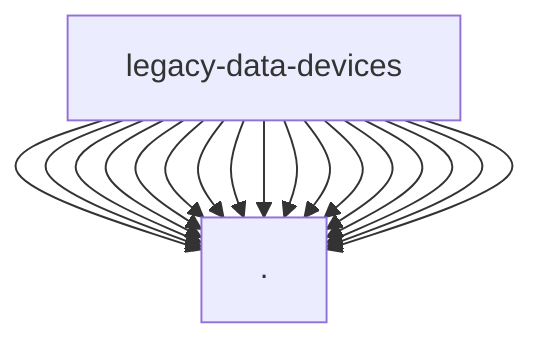

# Imports

[← Back to MODULE](MODULE.md) | [← Back to INDEX](../../INDEX.md)

## Dependency Graph

## External Dependencies

Dependencies from other modules:

- `./actionCameras.js`
- `./audio.js`
- `./batteries.js`
- `./batteryHotswaps.js`
- `./cages.js`
- `./cameras.js`
- `./carts.js`
- `./chargers.js`
- `./drones.js`
- `./fiz.js`
- `./gearList.js`
- `./gimbals.js`
- `./lights.js`
- `./monitors.js`
- `./recordingMedia.js`
- `./video.js`
- `./wirelessReceivers.js`

