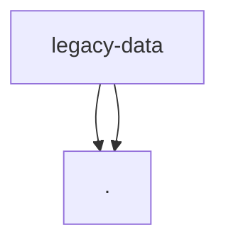

# Module: legacy/data

[← Back to INDEX](../../INDEX.md)

**Type:** js/ts | **Files:** 2

**Entry point:** `legacy/data/index.js`

## Files

| File | Lines | Large |
| ---- | ----- | ----- |
| `legacy/data/index.js` | 11 |  |
| `legacy/data/rental-houses.js` | 1624 | 📊 |

## Child Modules

- [legacy-data-devices](../legacy-data-devices/MODULE.md)

---

Symbol maps for 1 large files in this module.

## legacy/data/rental-houses.js (1624 lines)

| Line | Kind | Name | Visibility |
| ---- | ---- | ---- | ---------- |
| 1 | fn | _typeof | (private) |
| 2 | fn | resolveGlobalScope | (private) |
| 9 | fn | commitRentalCatalogToTarget | (private) |
| 41 | fn | commitRentalCatalogToGlobal | (private) |
---

## External Dependencies

Dependencies from other modules:

- `./devices`
- `./rental-houses`
