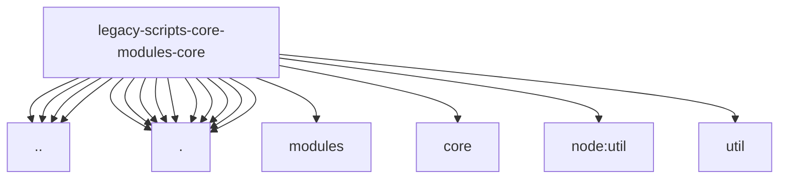

# Imports

[← Back to MODULE](MODULE.md) | [← Back to INDEX](../../INDEX.md)

## Dependency Graph

## External Dependencies

Dependencies from other modules:

- `../base.js`
- `../globals.js`
- `../localization.js`
- `../runtime-environment-helpers.js`
- `./localization-fallback-context.js`
- `./localization-fallback-registry.js`
- `./localization-fallbacks.js`
- `./localization-inline-fallbacks.js`
- `./localization.js`
- `./modules/localization.js`
- `./runtime-support-resolution.js`
- `./runtime.js`
- `./scope-utils.js`
- `./support-resolver.js`
- `./temperature-keys.js`
- `modules/core/pink-mode-animations.js`
- `node:util`
- `util`

