# Imports

[← Back to MODULE](MODULE.md) | [← Back to INDEX](../../INDEX.md)

## Dependency Graph

```mermaid
graph TD
    legacy_scripts_core[legacy-scripts-core] --> __[..]
    legacy_scripts_core[legacy-scripts-core] --> data[data]
    legacy_scripts_core[legacy-scripts-core] --> data[data]
    legacy_scripts_core[legacy-scripts-core] --> _[.]
    legacy_scripts_core[legacy-scripts-core] --> _[.]
    legacy_scripts_core[legacy-scripts-core] --> _[.]
    legacy_scripts_core[legacy-scripts-core] --> _[.]
    legacy_scripts_core[legacy-scripts-core] --> _[.]
    legacy_scripts_core[legacy-scripts-core] --> _[.]
    legacy_scripts_core[legacy-scripts-core] --> _[.]
    legacy_scripts_core[legacy-scripts-core] --> _[.]
    legacy_scripts_core[legacy-scripts-core] --> contacts[contacts]
    legacy_scripts_core[legacy-scripts-core] --> contacts[contacts]
    legacy_scripts_core[legacy-scripts-core] --> app_core[app-core]
    legacy_scripts_core[legacy-scripts-core] --> app_core[app-core]
    legacy_scripts_core[legacy-scripts-core] --> modules[modules]
    legacy_scripts_core[legacy-scripts-core] --> core[core]
    legacy_scripts_core[legacy-scripts-core] --> core[core]
    legacy_scripts_core[legacy-scripts-core] --> features[features]
    legacy_scripts_core[legacy-scripts-core] --> features[features]
    legacy_scripts_core[legacy-scripts-core] --> modules[modules]
    legacy_scripts_core[legacy-scripts-core] --> modules[modules]
    legacy_scripts_core[legacy-scripts-core] --> modules[modules]
    legacy_scripts_core[legacy-scripts-core] --> modules[modules]
    legacy_scripts_core[legacy-scripts-core] --> modules[modules]
    legacy_scripts_core[legacy-scripts-core] --> _[.]
    legacy_scripts_core[legacy-scripts-core] --> own_gear[own-gear]
    legacy_scripts_core[legacy-scripts-core] --> own_gear[own-gear]
    legacy_scripts_core[legacy-scripts-core] --> runtime[runtime]
    legacy_scripts_core[legacy-scripts-core] --> _[.]
    legacy_scripts_core[legacy-scripts-core] --> _[.]
    legacy_scripts_core[legacy-scripts-core] --> node_util[node:util]
    legacy_scripts_core[legacy-scripts-core] --> util[util]
```

## External Dependencies

Dependencies from other modules:

- `../../app-version.js`
- `../data/rental-houses.js`
- `../data/schema.json`
- `./app-core-auto-backup.js`
- `./app-core-auto-gear-ui.js`
- `./app-core-bootstrap.js`
- `./app-core-pink-mode.js`
- `./app-core-runtime-helpers.js`
- `./app-core-runtime-ui.js`
- `./app-core-text.js`
- `./app-core-ui-helpers.js`
- `./contacts/list.js`
- `./contacts/profile.js`
- `./modules/app-core/localization.js`
- `./modules/app-core/runtime.js`
- `./modules/core-shared.js`
- `./modules/core/device-schema.js`
- `./modules/core/runtime-module-loader.js`
- `./modules/features/backup.js`
- `./modules/features/feature-search-normalization.js`
- `./modules/gear-list.js`
- `./modules/logging-resolver.js`
- `./modules/runtime-environment-helpers.js`
- `./modules/ui-cache.js`
- `./modules/video-power-inputs.js`
- `./overview.js`
- `./own-gear/store.js`
- `./own-gear/view.js`
- `./runtime/bootstrap.js`
- `./storage.js`
- `./translations.js`
- `node:util`
- `util`

