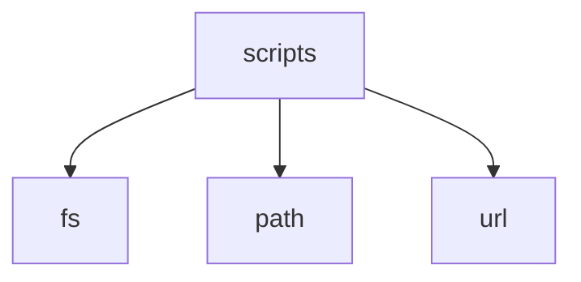

# Module: scripts

[← Back to INDEX](../../INDEX.md)

**Type:** implicit | **Files:** 7

## Files

| File | Lines | Large |
| ---- | ----- | ----- |
| `scripts/add-device-library-keys.mjs` | 104 |  |
| `scripts/apply-proper-translations.mjs` | 815 | 📊 |
| `scripts/apply-translation-patches.mjs` | 65 |  |
| `scripts/fix-nested-translations.mjs` | 151 |  |
| `scripts/translation-coverage.mjs` | 281 |  |
| `scripts/translation-key-checker.mjs` | 86 |  |
| `scripts/validate-translations.mjs` | 339 |  |

---

Symbol maps for 1 large files in this module.

## scripts/apply-proper-translations.mjs (815 lines)

| Line | Kind | Name | Visibility |
| ---- | ---- | ---- | ---------- |
| 772 | fn | applyTranslations | (private) |
| 805 | fn | main | (private) |
---

## External Dependencies

Dependencies from other modules:

- `fs`
- `path`
- `url`
