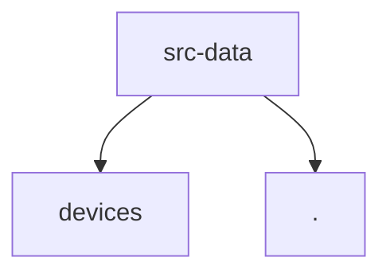

# Module: src/data

[← Back to INDEX](../../INDEX.md)

**Type:** js/ts | **Files:** 2

**Entry point:** `src/data/index.js`

## Files

| File | Lines | Large |
| ---- | ----- | ----- |
| `src/data/index.js` | 14 |  |
| `src/data/rental-houses.js` | 1701 | 📊 |

## Child Modules

- [src-data-devices](../src-data-devices/MODULE.md)

---

Symbol maps for 1 large files in this module.

## src/data/rental-houses.js (1701 lines)

_No symbols extracted._
---

## External Dependencies

Dependencies from other modules:

- `./devices/index.js`
- `./rental-houses.js`
