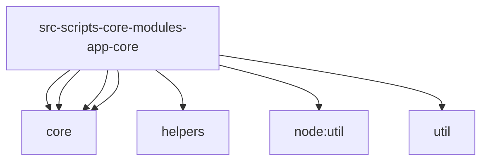

# Imports

[← Back to MODULE](MODULE.md) | [← Back to INDEX](../../INDEX.md)

## Dependency Graph

## External Dependencies

Dependencies from other modules:

- `../../../modules/core/bootstrap-environment.js`
- `../../../modules/core/bootstrap-results.js`
- `../../../modules/core/bootstrap.js`
- `../../../modules/helpers/scope-utils.js`
- `../core/runtime-module-loader.js`
- `node:util`
- `util`

