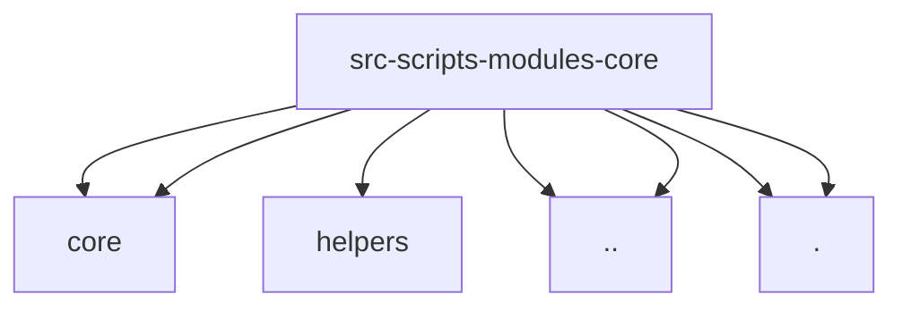

# Imports

[← Back to MODULE](MODULE.md) | [← Back to INDEX](../../INDEX.md)

## Dependency Graph

## External Dependencies

Dependencies from other modules:

- `../../core/app-core-runtime-candidate-scopes.js`
- `../../core/app-core-runtime-support.js`
- `../helpers/scope-utils.js`
- `../runtime-support.js`
- `../ui-helpers.js`
- `./bootstrap-environment.js`
- `./bootstrap-results.js`

