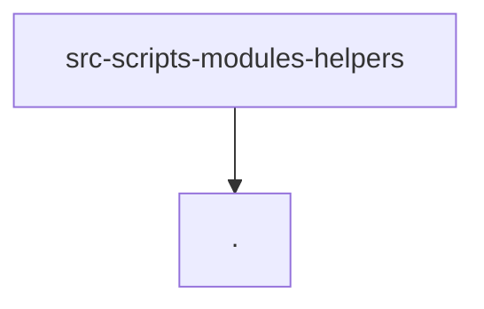

# Module: src/scripts/modules/helpers

[← Back to INDEX](../../INDEX.md)

**Type:** implicit | **Files:** 11

## Files

| File | Lines | Large |
| ---- | ----- | ----- |
| `src/scripts/modules/helpers/auto-gear.js` | 122 |  |
| `src/scripts/modules/helpers/connectors.js` | 57 |  |
| `src/scripts/modules/helpers/deep-clone.js` | 77 |  |
| `src/scripts/modules/helpers/download-manager.js` | 97 |  |
| `src/scripts/modules/helpers/freeze-registry.js` | 114 |  |
| `src/scripts/modules/helpers/global-scope.js` | 139 |  |
| `src/scripts/modules/helpers/icons.js` | 267 |  |
| `src/scripts/modules/helpers/immutability-builtins.js` | 240 |  |
| `src/scripts/modules/helpers/module-linker.js` | 533 | 📊 |
| `src/scripts/modules/helpers/scope-collector.js` | 238 |  |
| `src/scripts/modules/helpers/scope-utils.js` | 290 |  |

## Documentation

- [outline.md](outline.md) - Symbol maps for large files

---

## External Dependencies

Dependencies from other modules:

- `./scope-utils.js`
