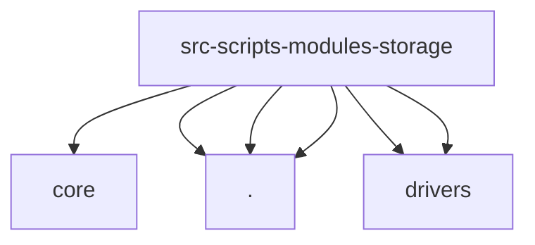

# Imports

[← Back to MODULE](MODULE.md) | [← Back to INDEX](../../INDEX.md)

## Dependency Graph

## External Dependencies

Dependencies from other modules:

- `../core/UserContext.js`
- `./ProjectLockService.js`
- `./StorageRepository.js`
- `./SyncMetadata.js`
- `./drivers/IndexedDBAdapter.js`
- `./drivers/LocalStorageAdapter.js`

