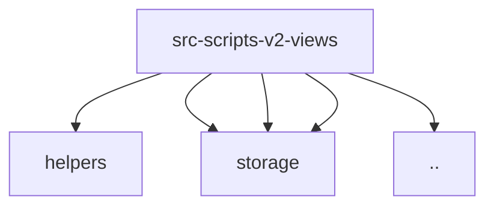

# Imports

[← Back to MODULE](MODULE.md) | [← Back to INDEX](../../INDEX.md)

## Dependency Graph

## External Dependencies

Dependencies from other modules:

- `../../modules/helpers/download-manager.js`
- `../../modules/storage/DataVault.js`
- `../../modules/storage/StorageRepository.js`
- `../../modules/storage/SyncMetadata.js`
- `../view.js`

