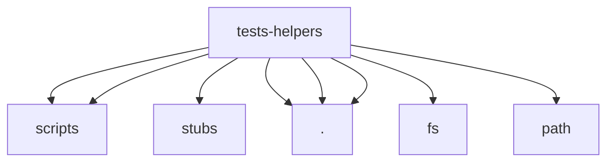

# Imports

[← Back to MODULE](MODULE.md) | [← Back to INDEX](../../INDEX.md)

## Dependency Graph

## Internal Dependencies

Dependencies within this module:

- `module`

## External Dependencies

Dependencies from other modules:

- `../../src/scripts/storage`
- `../../src/scripts/translations.js`
- `../stubs/searchTokensRuntime`
- `./domUtils`
- `./moduleArchitecture`
- `./runtimeLoader`
- `fs`
- `path`

