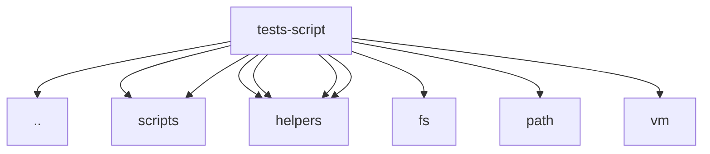

# Imports

[← Back to MODULE](MODULE.md) | [← Back to INDEX](../../INDEX.md)

## Dependency Graph

## External Dependencies

Dependencies from other modules:

- `../../package.json`
- `../../src/scripts/app-setups.js`
- `../../src/scripts/storage.js`
- `../helpers/domUtils`
- `../helpers/runtimeLoader`
- `../helpers/scriptEnvironment`
- `./helpers/loadApp`
- `fs`
- `path`
- `vm`

