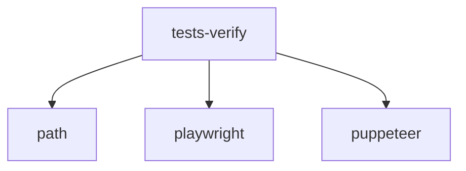

# Module: tests/verify

[← Back to INDEX](../../INDEX.md)

**Type:** implicit | **Files:** 15

## Files

| File | Lines | Large |
| ---- | ----- | ----- |
| `tests/verify/verify_auto_gear.js` | 113 |  |
| `tests/verify/verify_battery_comparison.js` | 133 |  |
| `tests/verify/verify_battery_comparison_restore.js` | 72 |  |
| `tests/verify/verify_calculations.js` | 110 |  |
| `tests/verify/verify_contacts.js` | 161 |  |
| `tests/verify/verify_device_manager.js` | 205 |  |
| `tests/verify/verify_feature_search.js` | 54 |  |
| `tests/verify/verify_full_tour.js` | 645 | 📊 |
| `tests/verify/verify_own_gear.js` | 155 |  |
| `tests/verify/verify_print_flow.js` | 71 |  |
| `tests/verify/verify_print_preview.js` | 71 |  |
| `tests/verify/verify_project_management.js` | 118 |  |
| `tests/verify/verify_settings.js` | 120 |  |
| `tests/verify/verify_smoke_test.js` | 135 |  |
| `tests/verify/verify_tour.js` | 163 |  |

---

Symbol maps for 1 large files in this module.

## tests/verify/verify_full_tour.js (645 lines)

| Line | Kind | Name | Visibility |
| ---- | ---- | ---- | ---------- |
| 2 | fn | log | (private) |
| 3 | fn | wait | (private) |
| 4 | fn | waitFor | (private) |
| 18 | fn | getCurrentStepIndex | (private) |
---

| High 🔴 | Medium 🟡 | Low 🟢 |
| 0 | 0 | 2 |

## 🟢 Low Priority

### `NOTE` (tests/verify/verify_battery_comparison.js:108)

> The table might be sorted by runtime.

### `NOTE` (tests/verify/verify_own_gear.js:109)

> In a real browser test, we would reload. Here we can simulate close/re-open or rely on local storage check.
---

## External Dependencies

Dependencies from other modules:

- `path`
- `playwright`
- `puppeteer`
