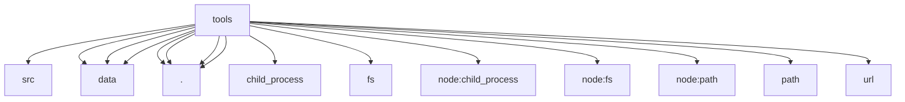

# Imports

[← Back to MODULE](MODULE.md) | [← Back to INDEX](../../INDEX.md)

## Dependency Graph

## External Dependencies

Dependencies from other modules:

- `../src/data`
- `../src/data/index.js`
- `../src/data/rental-houses`
- `../src/data/schema.json`
- `./devices`
- `./rental-houses`
- `./serviceWorkerAssetManifest`
- `./serviceWorkerAssetManifest.js`
- `child_process`
- `fs`
- `node:child_process`
- `node:fs`
- `node:path`
- `path`
- `url`

