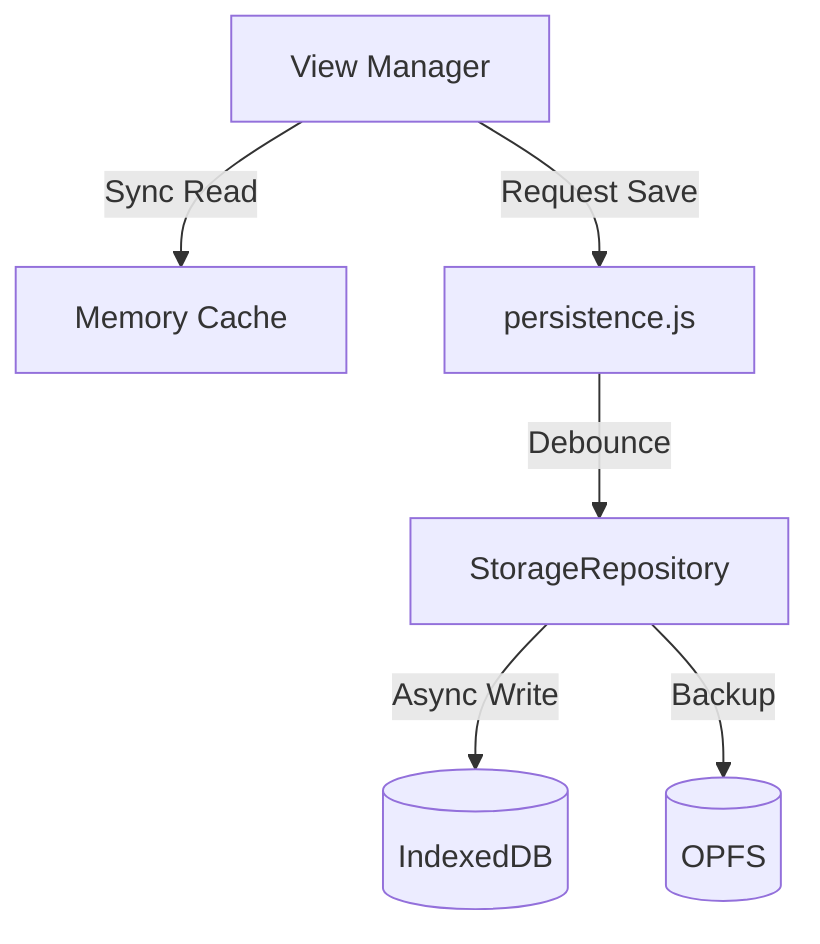

# CODEBASE MAP

> **For AI Agents:** Read this file FIRST. This is your "Operating System" for working on Cine Power Planner. Follow the Strategic Roadmap and Rules of Engagement strictly.

---

## 0. Strategic Roadmap & Status

### **Phase 1: Foundation (CURRENT - ACTIVE)**
*   **Goal**: Complete migration to Vite + ES Modules + IndexedDB/OPFS.
*   **Success Criteria**:
    *   Full feature parity in V2 UI.
    *   Zero reliance on `localStorage` for project data.
    *   All legacy polyfills functioning in modern build.
    *   Complete developer documentation (Architecture, Debugging, Migration).

### **Phase 2: Cleanup (PENDING)**
*   **Goal**: Retire V1 UI.
*   **Trigger**: Only after Phase 1 is 100% complete and verified.

### **Phase 3: Future Cloud (BLOCKED)**
*   **Goal**: React + Firebase (Auth/Storage/Multi-user).
*   **Constraint**: **DO NOT** attempt this until Phase 1 & 2 are complete and user explicitly authorizes "Phase 3".

---

## 1. System Anatomy (The Kernel)

The application uses a sophisticated internal module injection system for offline robustness.

*   **Registry Docs**: [Module Registry Reference](docs/dev/architecture/module-registry.md)
*   **Key Concept**: `cineModules`. Everything is a registered token (e.g., `cinePersistence`, `cineUi`).
*   **Constraint**: Use the Registry for cross-module dependencies, not raw imports.

---

## 2. Agent Rules of Engagement (The Law)

1.  **Respect the Hybrid Runtime**:
    *   **Globals**: Much of the app relies on `window.devices` / `window.setupSelect` (shimmed by `legacy-globals-shim.js`).
    *   **Access**: Use `globalThis.variableName` when touching legacy globals in modern code.
2.  **The "Twin-Store" Data Policy**:
    *   **READS**: Synchronous from In-Memory Cache (Zero `await` in render loop).
    *   **WRITES**: Async/Debounced via `persistence.js` (Manager) -> `StorageRepository.js` (Driver).
3.  **Strict "Offline-First"**:
    *   **Never** add runtime dependencies on CDNs or cloud APIs.
    *   **Everything** must be bundlable.

---

## 3. Strict File Layout Rules (The Map)

| Path | Purpose | Constraint |
| :--- | :--- | :--- |
| `src/scripts/core/` | **Kernel**. Boot, Lifecycle, Events. | **NO TOUCH** unless fixing critical bugs. |
| `src/scripts/modules/` | **Business Logic**. Pure JS, Storage, Calculations. | **Headless Only**. No UI code here. |
| `src/scripts/v2/views/` | **UI Components**. Rendering & Interaction. | **Presentation Only**. |
| `src/scripts/shims/` | **Legacy Bridge**. Fakes global scope. | Only edit when retiring a global. |
| `src/styles/v2/` | **Modern CSS**. BEM-like, scoped. | Use Design Tokens. |

---

## 4. New Feature Workflow (The Process)

Follow this checklist strictly when adding a new feature:

1.  **Logic**: Implement pure logic in `src/scripts/modules/features/my-feature.js`.
2.  **Registration**: Register your module with `cineModules` (See [Module Registry](docs/dev/architecture/module-registry.md)).
3.  **UI**: Create the view component in `src/scripts/v2/views/my-view.js`.
4.  **Routing**: Add the route to `src/scripts/v2/view-manager.js`.
5.  **Navigation**: Add the sidebar entry in `src/scripts/v2/sidebar.js`.
6.  **Localization**: Add all strings to `src/scripts/translations/en.js` first.

---

## 5. Deployment & Maintenance

### **Development Workflow**
*   **Quick Start**: `npm install` -> `npm run dev` (http://localhost:3000).
*   **Build**: `npm run build` (Production, Modern).
*   **Testing**:
    *   `npm run test:unit`: Logic (Fast).
    *   `npm run test:data`: Schema Integrity.
    *   `npm run test:dom`: UI Interactions.

### **Internationalization**
> **Guide**: [Translation Guide](docs/dev/translation-guide.md)
*   **Source of Truth**: `src/scripts/translations/en.js`.
*   **Rule**: Never hardcode English strings in `src/`.

### **Operations & Safety**
> **Manuals**: [Data Safety](docs/ops/data-protection-playbook.md) | [Emergency Recovery](docs/ops/emergency-recovery-playbook.md)
*   **Philosophy**: User Data is Sacred.
*   **Backup**: Offline app relies on `cineFeatureBackup` for snapshots.

---

## 6. High-Level Architecture

### **Data Flow & Storage**
> **Docs**: [Storage Layer Reference](docs/dev/architecture/storage-layer.md)

### **Legacy Integration**
> **Docs**: [Legacy Integration Reference](docs/dev/architecture/legacy-integration.md)
*   **Boot Sequence**: `Shim` -> `Bootstrap` -> `Main`.
*   **Events**: V2 uses "Shadow Triggers" to invoke legacy logic.

### **V2 UI Architecture**
> **Docs**: [V2 Views Documentation](docs/dev/architecture/v2-views.md)
*   **Router**: Hash-based (`#/projects`).
*   **Bridge**: `legacy-shim.js` reparents DOM nodes when needed.

---

## 9. Data Models (State)
> **Docs**: [Schema Inventory](docs/dev/schema-inventory.md)

*   **Project**: `cine_project:{uuid}` (IndexedDB).
*   **Device**: Static objects in `src/data/devices`.
*   **Evolution**: [Schema Evolution Guide](docs/dev/schema-evolution-guide.md) - Migrations.

---

## 10. Design System (The Look)
> **Docs**: [Design System Reference](docs/dev/architecture/design-system.md)

*   **Tokens**: `src/styles/style.css` (Global Colors/Spacing).
*   **Components**: `src/styles/v2/*.css` (Scoped BEM).
*   **Rule**: Use `--color-accent`, never hex codes.
*   **Cookbook**: [V2 Component Cookbook](docs/dev/v2-component-cookbook.md) - Copy-paste recipes.

---

## 11. Deep Dives (Hidden Complexity)
*   **Pink Mode**: [Docs](docs/dev/architecture/pink-mode.md) - Offline Lottie pipeline.
*   **Auto-Gear Rules**: [User Guide](docs/user/auto-gear-rule-options.md) - Soft-dependency engine.

### Migration & Refactoring
*   **Vite Migration**: [Guide](docs/dev/vite-migration.md) - ESM strategy.
*   **Release Management**: [Guide](docs/dev/release-management.md) - Versioning & Deploy.
*   **Data Maintenance**: [Guide](docs/dev/data-catalog-maintenance.md) - Adding devices & schema.
*   **Architecture**: [Design System](docs/dev/architecture/design-system.md) - Tokens & Theming.
*   **Reports**: [Runtime Status](docs/dev/reports/runtime-refactor-status-2025.md) - Archive.

### Governance
*   **Drift Runbook**: [Docs](docs/dev/documentation-drift-runbook.md) - QA protocol.
*   **Testing Plan**: [Plan](docs/dev/testing-plan.md) - QA Strategy.

### Troubleshooting
*   **Debugging Guide**: [Reference](docs/dev/debugging-guide.md) - Hybrid/Offline debugging.

---

## 13. Tooling (The Workshops)
> **Docs**: [Tooling Reference](docs/dev/tooling-reference.md) | [CI/CD](docs/dev/ci-cd-pipeline.md)

*   **Data Integrity**: `checkConsistency.js` (The Validitor).
*   **Build Helpers**: `generateServiceWorkerAssets.cjs` (The Hasher).
*   **Automation**: `normalizeData.cjs` (The Janitor).

---

## 14. Anti-Patterns (What NOT to do)
1.  **Do NOT use `navigator.onLine`**: Use `modules/offline.js`.
2.  **Do NOT ignore `persistence.js`**: Direct writes to IDB will break the sync queue.
3.  **Do NOT mix UI and Logic**: Keep `v2/views/` separate from `modules/`.

---

## 15. Standards & Policies
*   **Security**: [SECURITY.md](SECURITY.md) (Reporting & Safety).
*   **Performance**: [Performance Standards](docs/dev/performance-standards.md) (Budgets & Limits).

