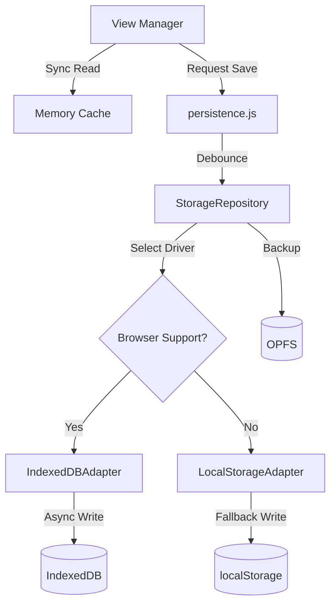

# CODEBASE MAP

> **For AI Agents:** Read this file FIRST. This is your "Operating System" for working on Cine Power Planner. Follow the Strategic Roadmap and Rules of Engagement strictly.

---

## 0. Strategic Roadmap & Status

### **Phase 1: Foundation (CURRENT - ACTIVE)**
*   **Goal**: Complete migration to Vite + ES Modules + IndexedDB/OPFS.
*   **Success Criteria**:
    *   Full feature parity in V2 UI.
    *   Zero reliance on `localStorage` for project data.
    *   All legacy polyfills functioning in modern build.
    *   Complete developer documentation (Architecture, Debugging, Migration).

### **Phase 2: Cleanup (PENDING)**
*   **Goal**: Retire V1 UI.
*   **Trigger**: Only after Phase 1 is 100% complete and verified.

### **Phase 3: Future Cloud (BLOCKED)**
*   **Goal**: React + Firebase (Auth/Storage/Multi-user).
*   **Constraint**: **DO NOT** attempt this until Phase 1 & 2 are complete and user explicitly authorizes "Phase 3".

---

## 1. System Anatomy (The Kernel)

The application uses a sophisticated internal module injection system for offline robustness.

*   **Registry Docs**: [Module Registry Reference](docs/dev/architecture/module-registry.md)
*   **Key Concept**: `cineModules`. Everything is a registered token (e.g., `cinePersistence`, `cineUi`).
*   **Constraint**: Use the Registry for cross-module dependencies, not raw imports.

---

## 2. Agent Rules of Engagement (The Law)

1.  **Respect the Hybrid Runtime**:
    *   **Globals**: Much of the app relies on `window.devices` / `window.setupSelect` (shimmed by `legacy-globals-shim.js`).
    *   **Access**: Use `globalThis.variableName` when touching legacy globals in modern code.
2.  **The "Twin-Store" Data Policy**:
    *   **READS**: Synchronous from In-Memory Cache (Zero `await` in render loop).
    *   **WRITES**: Async/Debounced via `persistence.js` (Manager) -> `StorageRepository.js` (Driver).
3.  **Strict "Offline-First"**:
    *   **Never** add runtime dependencies on CDNs or cloud APIs.
    *   **Everything** must be bundlable.

---

## 3. Project Directory Structure

```
cine-power-planner/
├── .agent/                    # Agent configuration & artifacts
│   ├── knowledge/             # Reusable patterns & solutions
│   ├── plans/                 # Implementation plans
│   ├── tasks/                 # Task tracking files
│   ├── walkthrough/           # Completed work documentation
│   └── workflows/             # Automation workflows
├── docs/                      # All documentation
│   ├── dev/                   # Developer documentation
│   │   ├── architecture/      # System architecture docs
│   │   ├── reports/           # Status reports
│   │   └── reviews/           # Code review docs
│   ├── ops/                   # Operations playbooks
│   └── user/                  # User-facing guides
├── legacy/                    # Legacy backup (read-only archive)
├── legal/                     # Legal documents
├── scripts/                   # Build & utility scripts
├── src/                       # Application source code
│   ├── animations/            # Lottie animations
│   ├── data/                  # Static device data
│   ├── fonts/                 # Font assets
│   ├── icons/                 # Icon assets
│   ├── illustrations/         # Illustration assets
│   ├── modules/               # Top-level ESM modules
│   ├── scripts/               # Core application JavaScript
│   ├── styles/                # CSS stylesheets
│   └── vendor/                # Third-party libraries
├── tests/                     # Test suites
│   ├── data/                  # Test data & fixtures
│   ├── dom/                   # DOM/UI tests
│   ├── helpers/               # Test utilities
│   ├── unit/                  # Unit tests
│   └── verify/                # Verification tests
└── tools/                     # Development tools
```

---

## 4. Source Code Layout (`src/scripts/`)

| Path | Purpose | Constraint |
| :--- | :--- | :--- |
| `core/` | **Kernel**. Boot, Lifecycle, Events, Session, Setups. | **NO TOUCH** unless fixing critical bugs. |
| `core/modules/` | Core sub-modules (persistence, storage, events). | Part of kernel, minimize changes. |
| `modules/` | **Business Logic**. Pure JS, Storage, Calculations. | **Headless Only**. No UI code here. |
| `modules/features/` | Feature modules (backup, search, print, etc.). | Self-contained features. |
| `modules/helpers/` | Utility modules (scope, freeze, auto-gear, icons). | Pure helper functions. |
| `modules/storage/` | Storage layer (Repository, Drivers, Migrations). | Data persistence only. |
| `modules/persistence/` | Persistence orchestration layer. | Sync/async coordination. |
| `v2/` | **V2 UI Framework**. Router, Views, Bootstrap. | UI concerns only. |
| `v2/views/` | **V2 View Components**. Individual pages/panels. | Presentation only. |
| `shims/` | **Legacy Bridge**. Fakes global scope. | Only edit when retiring a global. |
| `translations/` | Localization strings. | Use `t()` accessor. |
| `auto-gear/` | Auto-gear rule engine. | Complex rule logic. |

### Key Files Reference

| File | Description |
| :--- | :--- |
| `storage.js` | Master storage facade (563KB) – all storage operations. |
| `globals-bootstrap.js` | Global initialization & polyfills. |
| `core/app-core-new-1.js` | Primary app core (828KB) – setup logic. |
| `core/app-core-new-2.js` | Secondary app core (782KB) – UI logic. |
| `core/app-session.js` | Session management (733KB). |
| `core/app-setups.js` | Project setups management (611KB). |
| `core/app-events.js` | Event system (228KB). |
| `modules/logging.js` | Logging infrastructure (108KB). |
| `modules/offline.js` | Offline mode handling (120KB). |
| `modules/results.js` | Calculation results (150KB). |

---

## 5. Storage Architecture

### Storage Layer Components

```
src/scripts/modules/storage/
├── StorageRepository.js       # Main storage interface
├── StorageInterface.js        # Abstract interface
├── StorageMigrationService.js # Schema migrations
├── ProjectLockService.js      # Concurrent access control
├── DataVault.js              # Secure data encapsulation
├── SyncMetadata.js           # Sync state tracking
└── drivers/
    ├── IndexedDBAdapter.js   # Primary storage driver
    └── LocalStorageAdapter.js # Fallback driver
```

### Data Flow Diagram



---

## 6. V2 UI Architecture

### V2 Components

```
src/scripts/v2/
├── bootstrap.js              # V2 initialization
├── view-manager.js           # Hash-based router
├── sidebar.js                # Navigation sidebar
├── legacy-shim.js            # DOM bridging to V1
├── project-dashboard.js      # Project list/grid
├── project-detail.js         # Single project view
├── search-module.js          # Global search
├── help-service.js           # Help system
└── views/
    ├── backups-view.js       # Backup management
    ├── contacts-view.js      # Contacts management
    ├── device-library-view.js # Device browser
    ├── help-view.js          # Help panel
    ├── owned-gear-view.js    # User's gear list
    ├── rules-view.mjs        # Auto-gear rules
    ├── settings-view.js      # Preferences
    └── sidebar-view.js       # Sidebar UI
```

### V2 Routing

*   **Router**: Hash-based (`#/projects`, `#/settings`).
*   **Bridge**: `legacy-shim.js` reparents DOM nodes when needed.
*   **Mount Point**: V2 views render into `#v2-container`.

---

## 7. Test Infrastructure

### Test Organization

```
tests/
├── unit/                # 96+ unit test files
│   ├── storage*.test.js     # Storage tests
│   ├── autoGear*.test.js    # Auto-gear tests
│   ├── *Module.test.js      # Module tests
│   └── ...
├── dom/                 # 33+ DOM tests
├── data/                # 8 data integrity tests
├── verify/              # 15 verification tests
├── helpers/             # 7 test utilities
├── setup/               # Jest setup files
└── stubs/               # Mock data
```

### Testing Commands

*   `npm run test:unit` – Jest unit tests.
*   `npm run test:data` – Data schema tests.
*   `npm run test:dom` – DOM interaction tests.
*   `npm run test:jest` – All Jest tests.

---

## 8. Module System & ESM Migration

### Runtime Environment Modules

```
src/scripts/modules/
├── runtime-environment.js        # Unified runtime exports
├── runtime-environment-helpers.js # Runtime utilities
├── runtime-guard.js              # Safety checks
├── runtime-module-loader.js      # Dynamic loading
├── runtime-support.js            # Feature detection
├── restore-verification.js       # Backup restore verification
├── ui-feedback.js                # Loading overlay management
├── console-helpers.js            # Console method safety
├── emergency-modal-cleanup.js    # Stuck dialog cleanup
├── autosave-overlay.js           # Autosave status mirroring
├── loading-indicator.js          # "Preparing planner..." indicator
├── legal-topbar.js               # Static page theme/locale
├── static-theme.js               # Theme preference application
├── force-populate.js             # V2 boot population
├── translations.js               # Translation loader
├── overview/                     # Overview & Print logic
│   ├── generator.js              # Print overview generation
│   ├── print-manager.js          # Print dialog management
│   ├── gear-list.js              # Gear list utilities
│   └── logging.js                # Overview logging
├── core/
│   ├── localization-accessors.js # Localization Utilities
│   ├── auto-backup.js            # Auto backup logic & logging
│   ├── runtime-ui.js             # Runtime UI bridging
│   ├── runtime-shared.js         # Runtime Shared State
│   ├── runtime-helpers.js        # Runtime Fallback Helpers
│   ├── pink-mode.js              # Pink Mode logic
    ├── bootstrap.js              # Bootstrap Orchestrator
    ├── bootstrap-environment.js  # Bootstrap Environment Detection
    └── bootstrap-results.js      # Bootstrap Result Handling
├── ui/
│   ├── dynamic-forms.js          # Form Generation
│   ├── auto-gear-ui.js           # Auto Gear UI management
│   └── dom-definitions.js        # Global UI Definitions
├── events/
│   └── manager.js                # Event Management
└── helpers/
    ├── scope-utils.js            # Scope manipulation
    ├── freeze-registry.js        # Object freezing
    ├── global-scope.js           # Global access
    ├── auto-gear.js              # Auto-gear helpers
    ├── icons.js                  # Icon utilities
    ├── connectors.js             # Device connectors
    ├── immutability-builtins.js  # Immutable helpers
    ├── deep-clone.js             # Deep Clone utilities
    ├── module-linker.js          # Module linking
    ├── scope-collector.js        # Scope collection
    └── download-manager.js       # File download utility
```

### Shim Layer

```
src/scripts/shims/
├── legacy-globals-shim.js   # Global variable shims
├── legacy-shims.js          # Legacy API shims
├── globalthis-polyfill.js   # globalThis polyfill
└── vite-global-patches.js   # Vite-specific patches
```

---

## 9. Feature Modules

### Business Logic Features

```
src/scripts/modules/features/
├── auto-gear-rules.js           # Auto-gear rule engine (95KB)
├── backup.js                    # Backup system (90KB)
├── connection-diagram.js        # Cable diagrams (84KB)
├── onboarding-tour.js           # User onboarding (269KB)
├── feature-search-engine.js     # Search indexing (43KB)
├── feature-search.js            # Search UI (10KB)
├── print-preview.js             # Print layout (33KB)
├── print-workflow.js            # Print orchestration (9KB)
├── help.js                      # Help system (8KB)
├── contacts.js                  # Contact management (9KB)
├── own-gear.js                  # User gear management (8KB)
└── onboarding-loader-hook.js    # Tour loading (22KB)
```

---

## 10. New Feature Workflow (The Process)

Follow this checklist strictly when adding a new feature:

1.  **Logic**: Implement pure logic in `src/scripts/modules/features/my-feature.js`.
2.  **Registration**: Register your module with `cineModules` (See [Module Registry](docs/dev/architecture/module-registry.md)).
3.  **UI**: Create the view component in `src/scripts/v2/views/my-view.js`.
4.  **Routing**: Add the route to `src/scripts/v2/view-manager.js`.
5.  **Navigation**: Add the sidebar entry in `src/scripts/v2/sidebar.js`.
6.  **Localization**: Add all strings to `src/scripts/translations/en.js` first.

---

## 11. Development Workflow

### Quick Start

```bash
npm install          # Install dependencies
npm run dev          # Start dev server (http://localhost:3000)
```

### Build Commands

| Command | Purpose |
| :--- | :--- |
| `npm run dev` | Development server with HMR |
| `npm run build` | Production build |
| `npm run test:unit` | Unit tests |
| `npm run test:jest` | All Jest tests |
| `npm run lint` | ESLint check |

### Key Configuration Files

| File | Purpose |
| :--- | :--- |
| `vite.config.js` | Vite build configuration |
| `jest.config.cjs` | Jest test configuration |
| `eslint.config.js` | Linting rules |
| `babel.config.cjs` | Babel transpilation |
| `package.json` | Dependencies & scripts |

---

## 12. Data Models (State)

> **Docs**: [Schema Inventory](docs/dev/schema-inventory.md)

*   **Project**: `cine_project:{uuid}` (IndexedDB).
*   **Device**: Static objects in `src/data/devices`.
*   **Evolution**: [Schema Evolution Guide](docs/dev/schema-evolution-guide.md) - Migrations.

---

## 13. Design System (The Look)

> **Docs**: [Design System Reference](docs/dev/architecture/design-system.md)

*   **Tokens**: `src/styles/style.css` (Global Colors/Spacing).
*   **Components**: `src/styles/v2/*.css` (Scoped BEM).
*   **Rule**: Use `--color-accent`, never hex codes.
*   **Cookbook**: [V2 Component Cookbook](docs/dev/v2-component-cookbook.md) - Copy-paste recipes.

---

## 14. Deep Dives (Hidden Complexity)

*   **Pink Mode**: [Docs](docs/dev/architecture/pink-mode.md) - Offline Lottie pipeline.
*   **Auto-Gear Rules**: [User Guide](docs/user/auto-gear-rule-options.md) - Soft-dependency engine.

### Migration & Refactoring

*   **Vite Migration**: [Guide](docs/dev/vite-migration.md) - ESM strategy.
*   **Release Management**: [Guide](docs/dev/release-management.md) - Versioning & Deploy.
*   **Data Maintenance**: [Guide](docs/dev/data-catalog-maintenance.md) - Adding devices & schema.
*   **Architecture**: [Design System](docs/dev/architecture/design-system.md) - Tokens & Theming.
*   **Reports**: [Runtime Status](docs/dev/reports/runtime-refactor-status-2025.md) - Archive.

### Governance

*   **Drift Runbook**: [Docs](docs/dev/documentation-drift-runbook.md) - QA protocol.
*   **Testing Plan**: [Plan](docs/dev/testing-plan.md) - QA Strategy.

### Troubleshooting

*   **Debugging Guide**: [Reference](docs/dev/debugging-guide.md) - Hybrid/Offline debugging.

---

## 15. Tooling (The Workshops)

> **Docs**: [Tooling Reference](docs/dev/tooling-reference.md) | [CI/CD](docs/dev/ci-cd-pipeline.md)

*   **Data Integrity**: `checkConsistency.js` (The Validator).
*   **Build Helpers**: `generateServiceWorkerAssets.cjs` (The Hasher).
*   **Automation**: `normalizeData.cjs` (The Janitor).

### Tools Directory

```
tools/
├── checkConsistency.js           # Data validation
├── generateServiceWorkerAssets.cjs # SW manifest generator
├── normalizeData.cjs             # Data normalization
└── [15+ additional tools]
```

---

## 16. Internationalization

> **Guide**: [Translation Guide](docs/dev/translation-guide.md)

*   **Source of Truth**: `src/scripts/translations/en.js`.
*   **Supported Languages**: English, German, Spanish, French, Italian.
*   **Rule**: Never hardcode English strings in `src/`.

---

## 17. Anti-Patterns (What NOT to do)

1.  **Do NOT use `navigator.onLine`**: Use `modules/offline.js`.
2.  **Do NOT ignore `persistence.js`**: Direct writes to IDB will break the sync queue.
3.  **Do NOT mix UI and Logic**: Keep `v2/views/` separate from `modules/`.
4.  **Do NOT import from deep paths**: Use barrel files (`src/features/auth/index.js`).
5.  **Do NOT block render loops**: Keep reads synchronous from cache.

---

## 18. Standards & Policies

*   **Security**: [SECURITY.md](SECURITY.md) (Reporting & Safety).
*   **Performance**: [Performance Standards](docs/dev/performance-standards.md) (Budgets & Limits).
*   **Contributing**: [CONTRIBUTING.md](CONTRIBUTING.md) (How to contribute).
*   **Testing**: [TESTING.md](TESTING.md) (Test requirements).

---

## 19. Active Workstreams

| Workstream | Status | Description |
| :--- | :--- | :--- |
| ESM Migration | 🟡 In Progress | Finalizing Runtime Bootstrap & Verification |

| Storage Tests | 🟡 In Progress | Fixing storage test mock architecture |
| V2 UI Polish | 🟡 In Progress | Device Library overhaul complete, global dropdown styling fixed |
| Documentation | 🟢 Active | Continuous documentation updates |

---

*Last updated: 2026-01-18*
