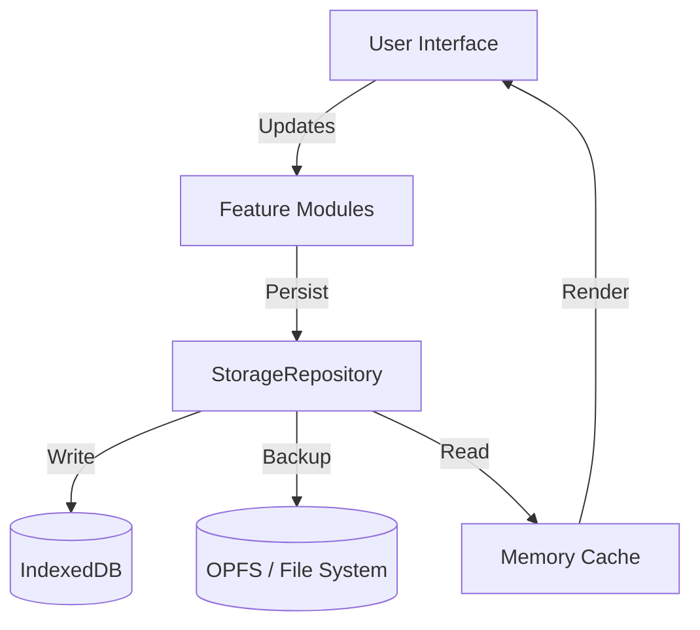

# Codebase Map

## High-Level Architecture
Cine Power Planner is a local-first web application for cinema power planning. It employs a modular JavaScript architecture (moving to ESM) with a robust storage layer utilizing IndexedDB and OPFS.

## Key Directories & Modules

| Module Path | Description | Files |
| :--- | :--- | :--- |
| `src/modules` | Core application modules | 3 |
| `src/data` | Data definitions & catalogues | ~21 |
| `src/scripts/modules/core` | Core logic modules | 19 |
| `src/scripts/modules/features` | Feature implementations | 14 |
| `src/scripts/modules/storage` | Persistence layer (DataVault, StorageRepo) | 7 |
| `src/scripts/modules/helpers` | Utility functions | 11 |
| `src/scripts/v2/views` | V2 User Interface Views | 8 |
| `src/scripts/translations` | Localization support | 5 |
| `legacy/` | Legacy code (scripts, data) | >50 |
| `tests/` | Test suites (Unit, DOM, Verify) | >70 |

## Data Flow

## Active Workstreams
- **ESM Migration**: Converting legacy scripts to standard ES modules.
- **Storage Hardening**: Improving `StorageRepository` and `DataVault`.
- **UI V2**: Implementing new views in `src/scripts/v2`.
- **Testing**: Expanding test coverage in `tests/`.

## AgentLens Navigation
An automated map of the codebase is available in `.agentlens/INDEX.md`.
Use it to explore:
- Module dependencies (`imports.md`)
- Large file outlines (`outline.md`)
- Warnings and TODOs (`memory.md`)
