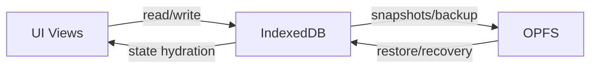

# Codebase Map

## High-Level Architecture
Cine Power Planner is a Vite-based, local-first web app for planning camera power setups. It relies on offline-safe storage (IndexedDB and OPFS) to preserve user projects, autosaves, backups, and restore flows without data loss.

## Key Directories
```
src/
  animations/       Lottie and motion assets.
  data/             Data catalogs and schema-driven definitions.
  fonts/            Local fonts for offline use.
  icons/            Local icon assets (Uicons and app-specific icons).
  illustrations/    Local illustration assets.
  modules/          Core app modules, runtime bridges, and feature modules.
  scripts/          Legacy/runtime scripts and app core helpers.
  styles/           Global styles and theme variants.
  vendor/           Third-party bundles checked into the repo.
```

## Data Flow


## Active Workstreams
- None currently tracked.
