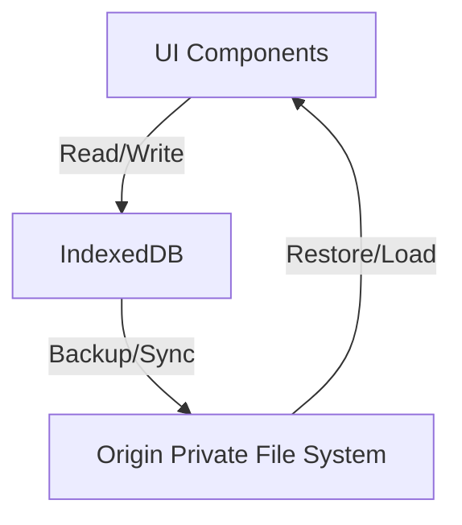

# CODEBASE_MAP

## High-Level Architecture
Cine Power Planner is an offline-first, browser-based power planning tool that runs on Vite and stores project data locally for reliability in disconnected environments.

## Key Directories
```
src/        # Application source code (features, scripts, runtime bootstrap)
scripts/    # Tooling and developer scripts
legacy/     # Legacy build assets and compatibility bundles
build/      # Build artifacts and intermediate output
dist/       # Production build output
docs/       # Documentation assets
tests/      # Test suites and fixtures
tools/      # Build and maintenance utilities
```

## Data Flow


## Active Workstreams
- Runtime bootstrap documentation updates (current)
