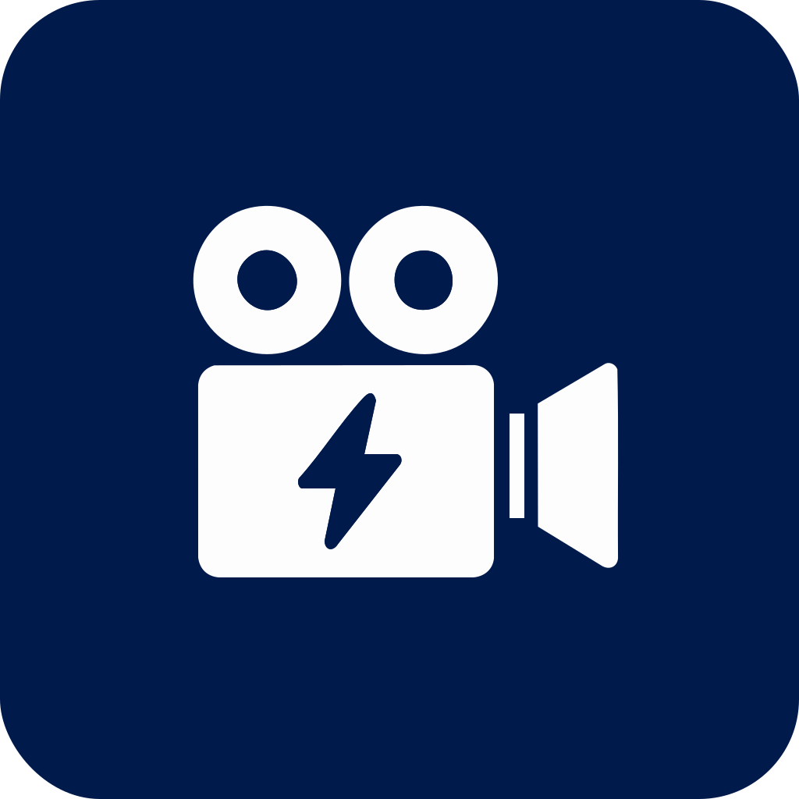

# Cine Power Planner

Cine Power Planner ist eine offlinefähige Web-App zum Planen professioneller Kamerarigs, die mit V-Mount-, B-Mount- oder Gold-Mount-Akkus betrieben werden. Sie berechnet die Gesamtleistung, prüft, ob jeder Akku den benötigten Strom sicher liefern kann, erstellt realistische Laufzeiten aus gewichteten Praxiserfahrungen und hält Crew, Szenarien sowie Packlisten zusammen, damit zwischen den Gewerken nichts verloren geht.

---

## Highlights

### Komplexe Setups ohne Ratespiel
- Kombiniere Kameras, Akkubasen, Funkstrecken, Monitore, Motoren und Zubehör und sieh dabei Gesamtwatt, Stromaufnahme bei 14,4 V/12 V (sowie 33,6 V/21,6 V bei B-Mount) und die erwartete Laufzeit.
- Vergleiche kompatible Akkus nebeneinander und erhalte Warnungen, wenn die Belastung D-Tap- oder Pin-Grenzen überschreitet.
- Visualisiere Rigs mit einem interaktiven Diagramm mit Drag&Drop, Zoom, SVG/JPG-Export und Kompatibilitäts-Hinweisen.

### Alle Abteilungen im selben Bild
- Speichere mehrere Projekte inklusive Anforderungen, Crewkontakten, Drehszenarien und eigenen Notizen.
- Erstelle druckbare Packlisten, die Equipment nach Kategorie gruppieren, Duplikate zusammenfassen, technische Metadaten enthalten und szenariobasierte Extras ergänzen.
- Teile JSON-Pakete, die Gerätauswahl, Laufzeitfeedback, Packlisten und eigene Geräte für eine vollständige Wiederherstellung enthalten.

### Reisebereit und privat
- Läuft vollständig im Browser – öffne `index.html` direkt oder hoste das Repository über HTTPS, um den Service Worker zu aktivieren.
- Offline-Caching hält Sprache, Theme, Favoriten und Projekte überall verfügbar, ohne Daten an externe Server zu senden.
- Leere den lokalen Cache oder nutze den Force-Reload, um gecachte Assets zu aktualisieren, ohne Projekte zu verlieren.

### Für dein Team anpassbar
- Wechsle sofort zwischen Englisch, Deutsch, Spanisch, Italienisch und Französisch; der Planner merkt sich die zuletzt verwendete Sprache.
- Wähle dunkle, pinke oder kontrastreiche Themes, setze eine eigene Akzentfarbe, passe Schriftgröße an und wähle die Schriftart, die zu Stage-Branding oder Barrierefreiheit passt.
- Tippe direkt in Dropdowns, pinne Favoriten und aktiviere Hover-Hilfe, damit die Crew am Set produktiv bleibt.

---

## Schnellstart

1. Repository klonen oder herunterladen.
2. `index.html` in einem aktuellen Chromium-, Firefox- oder Safari-Browser öffnen – es ist kein Build-Schritt nötig.
3. Optional den Ordner über HTTPS ausliefern, um den Service Worker für Offline-Updates zu installieren. Jeder Static-Server funktioniert (`npx http-server -S` o. ä.).
4. Die App speichert Daten im Browser. Nutze **Einstellungen → Backup**, um vor einem Gerätewechsel JSON-Sicherungen zu exportieren.

---

## Typischer Workflow

1. **Projekt anlegen oder laden.** Enter oder `Strg+S` (`⌘S` auf macOS) speichern schnell. Automatische Snapshots laufen alle 10 Minuten.
2. **Kamera, Stromversorgung und Zubehör wählen.** Dropdowns filtern beim Tippen, Favoriten bleiben angepinnt.
3. **Leistungswerte prüfen.** Watt, Stromaufnahme, Sicherheitsindikatoren und Laufzeiten im Vergleichspanel kontrollieren.
4. **Anforderungen erfassen.** Crewrollen, Drehtage, Szenarien und Notizen dokumentieren, damit jeder Export den passenden Kontext trägt.
5. **Ausgaben erzeugen.** Packlisten, druckbare Übersichten und Shared-Projekt-Bundles erstellen und später mit einem Upload wiederherstellen.

---

## Interface-Essentials

- **Globale Suche** (`/` oder `Strg+K`/`⌘K`) springt zu Funktionen, Auswahlfeldern oder Hilfetexten – auch bei eingeklapptem Menü.
- **Hilfecenter** (`?`, `H`, `F1` oder `Strg+/`) liefert durchsuchbare Guides, FAQs, Shortcuts und optionale Hover-Hilfe.
- **Projektdiagramm** visualisiert Verbindungen; beim Download mit gedrückter Umschalttaste als JPG statt SVG exportieren.
- **Akkuvergleich** zeigt die Leistung aller kompatiblen Packs und hebt Überlast-Risiken hervor.
- **Packlisten-Generator** wandelt Auswahl in kategorisierte Tabellen mit Metadaten, Crew-E-Mails und szenariobasierten Ergänzungen um.
- **Offline-Indikator & Force Reload** zeigen Verbindungsstatus und aktualisieren gecachte Assets ohne Projektverlust.

---

## Daten- & Export-Management

- Projekte, Einstellungen, Packlisten, Favoriten und eigene Geräte liegen in `localStorage`; Backups und Restores halten alles zusammen.
- Der Einstellungsdialog bietet stündliche Backup-Erinnerungen, manuelle Sicherungen, Ein-Klick-Restore und einen **Lokalen Cache leeren**-Button.
- Geteilte Projektdateien bündeln Auswahl, Anforderungen, Laufzeitfeedback, Packlisten und Custom Devices für nahtlose Übergaben.
- Druckübersichten enthalten Projektnamen, Produktionsdetails, optionales Logo und die generierte Packliste.
- Automatische Snapshots laufen im Hintergrund, um schnell zu einem früheren Stand zurückzukehren.

---

## Akku- & Laufzeit-Intelligenz

- Berechnet Gesamtverbrauch, benötigte Akkuanzahl für 10-Stunden-Tage und die Stromaufnahme jeder Verbindung.
- Warnt ab 80 % Auslastung und blockiert unsichere Lasten, wenn die Dauer- oder D-Tap-Leistung überschritten wird.
- Gewichtete Laufzeiten berücksichtigen Temperatur, Auflösung, Framerate, Codec, WLAN-Nutzung, Monitorhelligkeit und den Leistungsanteil jedes Geräts.
- Ein Laufzeit-Dashboard sortiert Feedback nach Gewichtung, zeigt Beitragsprozente und markiert Ausreißer.
- Nutzerfeedback fließt ein, um Schätzungen für reale Drehs zu präzisieren.

---

## Anpassung & Barrierefreiheit

- Dunkle, pinke oder kontrastreiche Themes und Typografie-Einstellungen lassen sich ohne Reload umschalten.
- Eigenes Logo für Drucke hochladen, Standard-Monitorrollen setzen und Projektanforderungen vorkonfigurieren.
- Tastaturfreundliche Navigation, sichtbare Fokuszustände und Skip-Links unterstützen Screenreader und Barrierefreiheit am Set.
- Tippen zum Filtern, angepinnte Favoriten und Fork-Buttons in Packlisten beschleunigen wiederholte Eingaben.

---

## Tastenkürzel

| Aktion | Shortcut |
| --- | --- |
| Globale Suche fokussieren | `/`, `Strg+K`, `⌘K` |
| Hilfedialog öffnen | `?`, `H`, `F1`, `Strg+/` |
| Projekt speichern | `Enter`, `Strg+S`, `⌘S` |
| Dark Theme umschalten | `D` |
| Pinkes Theme umschalten | `P` |
| Force Reload | 🔄-Symbol in der Kopfzeile klicken |

---

## Entwicklung

- Abhängigkeiten mit `npm install` installieren (für Linting, Tests und Datenskripte – kein Build erforderlich).
- Vor Commits `npm run lint` und `npm run test` ausführen. Gezielte Suites gibt es via `npm run test:unit`, `npm run test:data`, `npm run test:dom` und `npm run test:script`.
- Nützliche Skripte:
  - `npm run check-consistency` prüft die Datenkonsistenz.
  - `npm run normalize` und `npm run unify-ports` halten den Katalog sauber.
  - `npm run generate-schema` aktualisiert das Geräteschema.

---

## Übersetzungen

Die Dokumentation steht in mehreren Sprachen bereit; die App übernimmt beim ersten Start automatisch die Browser-Sprache. Der Wechsel ist jederzeit über das Sprachmenü oben rechts möglich:

- 🇬🇧 [English](README.en.md)
- 🇩🇪 [Deutsch](README.de.md)
- 🇪🇸 [Español](README.es.md)
- 🇮🇹 [Italiano](README.it.md)
- 🇫🇷 [Français](README.fr.md)

Du möchtest helfen? Folge der [Übersetzungsanleitung](docs/translation-guide.md), um neue Sprachen für Interface und Dokumentation hinzuzufügen.

---

## Beitrag & Support

Bugreports, Feature-Ideen und Datenkorrekturen sind willkommen. Eröffne ein Issue oder sende einen Pull Request mit möglichst vielen Details. Bei falschen Laufzeiten oder fehlendem Equipment bitte Projektdatei oder Beispieldaten anhängen, damit der Katalog verlässlich bleibt.

---

## Lizenz

Cine Power Planner wird unter der ISC-Lizenz veröffentlicht.
