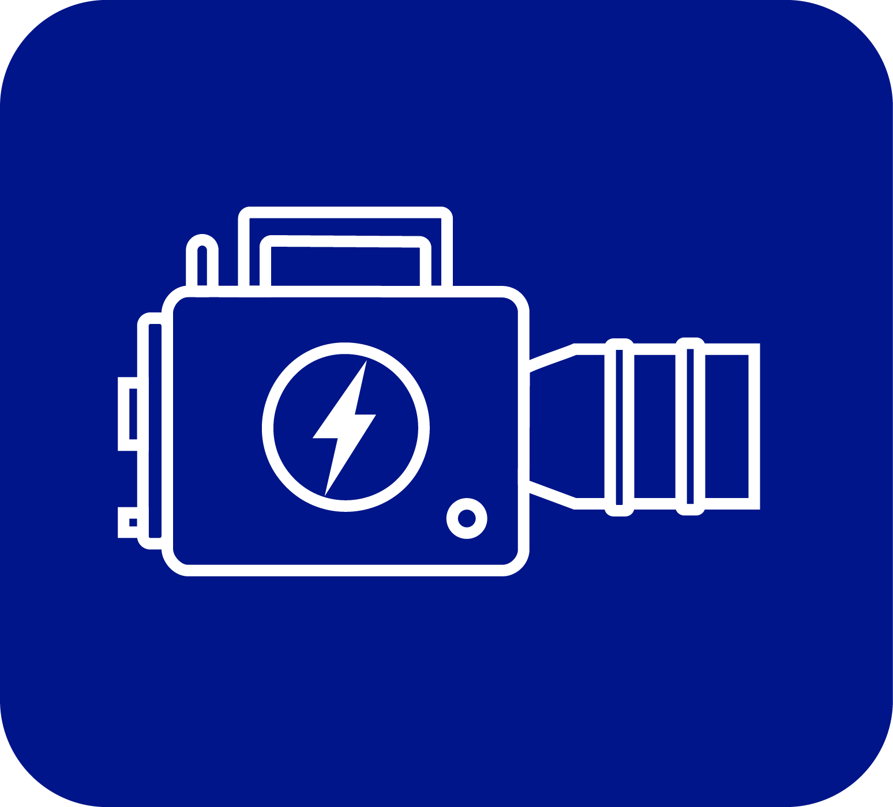

# Cine Power Planner



**Current release:** 1.0.53 | **License:** ISC | **Node:** >=18 (dev tooling)

Cine Power Planner is a standalone web app for building, auditing, and sharing
professional camera power plans that never leave your machine. Plan V‑Mount,
B‑Mount or Gold‑Mount rigs, model runtime expectations, capture project
requirements, and export shareable bundles—entirely inside your browser, even
when you are offline. Every dependency lives in this repository so the same
experience runs on a stage workstation, a field laptop, or an air-gapped archive
without phoning home.

## Data Protection Promise

- **Local-only storage.** Projects, gear lists, runtime feedback, exports, and
  backups live on your machine in IndexedDB, with OPFS as the backup target
  where supported; legacy localStorage remains as a fallback. The planner does
  not depend on external services.
- **Optional Cloud Sync.** Connect to Firebase Studio to sync projects across
  devices without sacrificing local ownership.
- **Layered safety nets.** Save, autosave, share, import, backup, and restore
  workflows always create safety snapshots so recovery is possible before any
  data is promoted.
- **Offline by design.** All icons, Uicons, fonts, and helper scripts are stored
  in this repo, so offline usage never degrades usability or data protection.

## Start here (short drill)

1. Open `index.html` in a supported browser. Keep the repository intact so every
   offline icon, font, and help asset loads locally.
2. Run **Help → Quick start checklist** to rehearse save, share, import, backup,
   and restore behaviors end-to-end on this workstation.
3. Export a planner backup and a project bundle immediately after the drill.
   Store them on separate offline media to establish a safe restore point.
4. Disconnect from the network and reload. Confirm projects, help, and the
   **Force reload** action still work without touching saved data.

## Data safety workflow (every session)

1. **Save + autosave.** Save after meaningful edits; autosave keeps rolling local
   snapshots in case you need to roll back.
2. **Share/export = copy, not move.** Project bundles and planner backups always
   duplicate data. Store at least two offline copies before deleting anything.
3. **Import/restore with verification.** Each restore creates a pre-restore
   safety backup and lists compatibility notes before promotion.
4. **Drill recovery.** Run a restore test from a backup or share bundle
   periodically to confirm this workstation can recover data end-to-end.

## Documentation index

The canonical documentation hub lives in [`docs/README.md`](docs/README.md).
It groups offline guidance by audience (users, operations, developers) and by
workflow so each routine is documented once.

- **Users:** start with the
  [User Guide](docs/user/user-guide.md) and the
  [Data Protection Lifecycle Guide](docs/user/data-protection-lifecycle.md).
- **Operations:** rehearse with the
  [Operations Checklist](docs/ops/operations-checklist.md) and
  [Offline Readiness Runbook](docs/ops/offline-readiness.md).
- **Developers:** follow the
  [Development & Maintenance Guide](docs/dev/development.md) and the
  [Documentation Maintenance Guide](docs/dev/documentation-maintenance.md).

## New: V2 User Interface

The application now features a completely redesigned, responsive V2 User Interface.

### Dashboard & Navigation
- **Modern Dashboard**: Manage all your projects from a unified, searchable grid view with color-coded tiles showing project status, dates, and quick actions.
- **Sidebar Navigation**: Quickly access Projects, Device Library, Contacts, Owned Gear, Automatic Gear Rules, Settings, and Help from a persistent, collapsible sidebar.
- **Mobile-First Design**: Fully responsive layout with mobile sidebar toggle and touch-optimized controls.

### Project Management
- **Project Status Tracking**: Track projects through workflow stages—Draft, Planning, Waiting for Approval, Approved, Shooting, Completed, and Archived—with color-coded status indicators.
- **Tabbed Project Views**: Navigate between Camera Package, Power Summary, Requirements, and Gear List tabs within each project.
- **Context Menus**: Right-click project tiles for quick actions like duplicate, archive, export, or delete.

### Tools & Data
- **Device Library**: Browse and manage your equipment database with filtering and search.
- **Contacts Management**: Maintain a crew roster with roles, contact details, and profile photos. Import contacts from vCard files.
- **Owned Gear Tracking**: Catalog your personal equipment inventory with quantities and sourcing notes.
- **Automatic Gear Rules**: Configure scenario-triggered equipment additions or removals.

### Visual Enhancements
- **Enhanced Dark Mode**: Refined dark theme with improved contrast and readability.
- **Pink Mode**: Fun accent theme with animated "icon rain" effect.
- **Theme Controls**: Quick-access toggles in the sidebar for dark mode, pink mode, and forced refresh.

## Key features

- **Equipment power knowledge base.** Reference bundled draw figures or extend
  the local catalog with your own entries.
- **Battery runtime planning.** Combine capacities, voltages, and runtime
  feedback so estimates stay grounded in real-world usage.
- **Custom rig configurations.** Mix cameras, accessories, and crew
  requirements, then export bundles or backups without risking data loss.
- **Offline-first operation.** Every asset ships with the repo, so autosave,
  backup, restore, share, and help stay fully functional without a network.
- **Firebase Studio Integration.** Optionally sync your projects to the cloud for real-time collaboration and multi-device access.
- **Restore compatibility summaries.** Every restore lists missing sections and
  keeps a pre-restore safety backup so crews can verify changes before
  promotion.

## Installation

1. Clone or download this repository to a trusted local drive:
   ```bash
   git clone /path/to/cine-power-planner.git
   cd cine-power-planner
   npm install
   ```
   (If you received an offline bundle, unpack it to a local folder instead.)
2. Start the development server:
   ```bash
   npm run dev
   ```
   This opens the app at `http://localhost:3000` with hot module replacement.
3. For production builds:
   ```bash
   npm run build      # Build to dist/
   npm run preview    # Preview the production build
   ```
4. (Offline usage) Open `index.html` directly in a supported browser for fully
   offline use. All assets load from the repository without a network connection.

## Quick Command Reference

| Command | Description |
| --- | --- |
| `npm run dev` | Start Vite dev server with HMR |
| `npm run build` | Production build to `dist/` |
| `npm test` | Run full test suite (lint + checks + Jest) |
| `npm run lint` | Run ESLint |
| `npm run check-consistency` | Validate device data and SW manifest |
| `npm run help` | Print all available scripts |

See [Development & Maintenance Guide](docs/dev/development.md) for the complete
npm scripts reference and troubleshooting tips.

## Translations

Keep localized README files synchronized with this README whenever workflows
change, especially anything touching saving, sharing, importing, backup, or
restore steps.

- [Deutsch](README.de.md)
- [English](README.en.md)
- [Español](README.es.md)
- [Français](README.fr.md)
- [Italiano](README.it.md)

## License

Distributed under the ISC license. See `package.json` for details.
