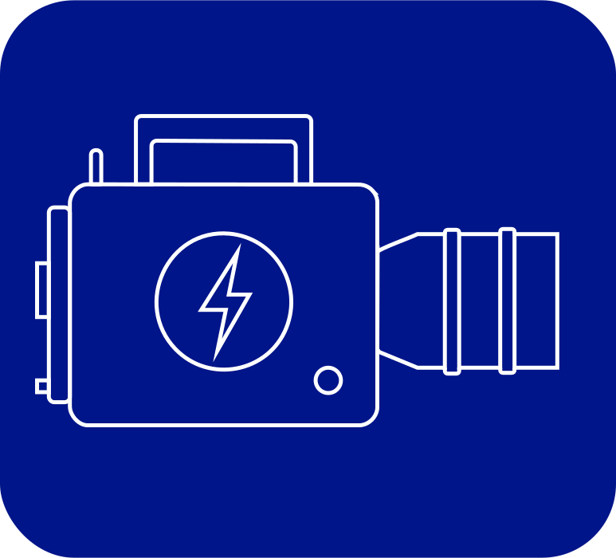

# Cine Power Planner



Cine Power Planner est une application web autonome pour créer, auditer et partager des plans d’alimentation professionnels qui ne quittent jamais votre machine. Configurez des rigs V‑Mount, B‑Mount ou Gold-Mount, modélisez les autonomies, consignez les exigences du projet et exportez des lots partageables, entièrement dans le navigateur, même hors ligne. Toutes les dépendances résident dans ce dépôt, garantissant la même expérience sur un poste de plateau, un ordinateur portable de tournage ou un disque isolé.

## Fonctionnalités principales

- **Base de données énergétique des équipements.** Consultez les valeurs de consommation fournies pour caméras, moniteurs, émetteurs, éclairages et accessoires, ou enrichissez le catalogue local avec vos propres fiches afin que chaque projet repose sur des données vérifiées.
- **Planification d’autonomie.** Combinez capacités de batterie, familles de tension et comportements de décharge pour estimer la durée de chaque rig avant changement de pack. Le retour d’autonomie garde ces attentes visibles pendant la préparation et les répétitions.
- **Configurations sur mesure.** Assemblez caméras, accessoires, exigences d’équipe et scénarios enregistrés pour refléter fidèlement l’installation utilisée sur le plateau. Exportez bundles ou sauvegardes à tout moment sans compromettre les données.
- **Répétitions de sécurité et traçabilité.** Parcours guidés, journaux de diff automatiques et paquets de vérification facilitent la preuve que sauvegarde, partage, import, backup et restauration protègent chaque donnée utilisateur, même sans reconnecter la machine.
- **Fonctionnement hors ligne garanti.** Tous les icônes, polices, Uicons et scripts fournis voyagent avec le dépôt. Autosave, backup, restauration, partage et aide fonctionnent intégralement en local pour travailler sereinement en environnement isolé.
- **Recherche globale sensible aux synonymes.** Des mots-clés de sécurité comme « trash », « archive », « sauvegarder », « récupérer » ou « rollback » mènent désormais directement aux outils de suppression, de sauvegarde et de restauration afin de protéger les données sans effort.

## Installation

1. Clonez ou téléchargez ce dépôt sur un support local de confiance :
   ```bash
   git clone https://github.com/Hugo9809/cine-power-planner.git
   cd cine-power-planner
   ```
   (Si vous recevez un bundle hors ligne, extrayez-le dans un dossier local.)
2. Ouvrez `index.html` directement dans un navigateur compatible. Tous les assets proviennent du dépôt, vous pouvez donc couper la connexion immédiatement.
3. (Facultatif) Servez le dossier sur `http://localhost` pour activer le service worker embarqué et l’installation PWA. Tout serveur statique convient hors ligne, par exemple :
   ```bash
   npx http-server
   # ou
   python -m http.server
   ```
4. Suivez le [Démarrage rapide](#démarrage-rapide) afin de répéter sauvegarde, partage, import, backup et restauration sur chaque poste avant de dépendre du planner sur le terrain.

## En résumé

- **Planification hors ligne en priorité.** Concevez des configurations V‑Mount, B‑Mount ou Gold-Mount directement dans le navigateur. Tous les Uicons, polices et scripts auxiliaires sont fournis localement, sans dépendre de CDNs ni du réseau. Clonez le dépôt, débranchez le câble et l’interface reste identique.
- **Données conservées sur l’appareil.** Projets, retours d’autonomie, favoris, équipements personnalisés, listes et préférences restent locaux. Les sauvegardes et lots partageables sont des fichiers JSON lisibles.
- **Réseaux de sécurité éprouvés.** Sauvegardes manuelles, enregistrements automatiques en arrière-plan et backups horodatés se complètent pour répéter la boucle Sauvegarder → Backup → Bundle → Restaurer dès la première utilisation.
- **Mises à jour sous contrôle.** Le service worker attend votre validation avant d’actualiser afin que les équipes restent sur une version vérifiée, même en déplacement ou avec une connectivité limitée.

## Couches de sécurité en un coup d’œil

| Filet de sécurité | Ce qu’il protège | Comment l’activer | Preuves à archiver |
| --- | --- | --- | --- |
| Sauvegardes manuelles | L’état courant du projet : équipements, notes d’autonomie et listes de matériel. | Appuyer sur **Entrée**, cliquer sur **Sauvegarder** ou utiliser `Ctrl+S`/`⌘S`. | Entrées horodatées dans le sélecteur et journaux de diff exportés depuis **Comparer les versions**. |
| Cadence d’autosave et d’auto-backup | Des instantanés continus qui capturent les modifications en cours. | Laisser le projet ouvert : une capture toutes les ~50 modifications ou 10 minutes. | Entrées `auto-backup-…` dans le sélecteur et chronologie **Activité récente**. |
| Backup complet du planner | L’ensemble des projets, favoris, retours d’autonomie, règles automatiques et préférences. | **Paramètres → Sauvegarde & restauration → Backup** (ou **Protections express**). | `planner-backup.json`, exports du journal d’historique et annexes du rapport de vérification. |
| Exports de bundles projet | Projets individuels prêts pour un transfert vers un autre poste. | **Exporter le projet** depuis le sélecteur. | Fichiers `nom-du-projet.json` (ou `.cpproject` renommés) accompagnés de notes de checksum. |
| Bac à sable de répétition de restauration | Assurance que les imports/restaurations fonctionnent avant de toucher aux données actives. | **Paramètres → Sauvegarde & restauration → Répétition de restauration**. | Capture console de `window.__cineRuntimeIntegrity`, notes de répétition et captures du bac à sable. |
| Mises à jour documentation & traductions | Articles d’aide, READMEs localisés et guides imprimables. | Suivre la checklist de maintenance documentaire à chaque évolution fonctionnelle. | Docs mises à jour dans `docs/`, fichiers `README.*.md` localisés et paquets de vérification signés. |

## Accès rapides

- **Lancer la répétition complète.** Suivez l’exercice de [Démarrage rapide](#démarrage-rapide) pour valider sauvegarde, partage, import, backup et restauration sur chaque poste, même hors ligne.
- **Consulter les workflows.** Gardez à portée l’[Exercice sauvegarde/partage/import](#exercice-sauvegardepartageimport) et la [référence détaillée Sauvegarde, partage, import, backup & restauration](docs/save-share-restore-reference.md) pendant les formations ou audits.
- **Prouver la préparation hors ligne.** Associez le [Runbook de préparation offline](docs/offline-readiness.md) à la [check-list opérationnelle](docs/operations-checklist.md) pour synchroniser répétitions documentées, application et ressources embarquées.
- **Re-certifier les bundles en cache.** Suivez le [Drill de vérification du cache hors ligne & protections](docs/offline-cache-verification-drill.md) après toute régénération d’assets service worker, ajout d’icônes ou modification de la persistance, afin de garantir la parité avec le dépôt.
- **Protéger délibérément les données utilisateur.** Appuyez-vous sur le [Playbook de protection des données](docs/data-protection-playbook.md) pour cadrer les évolutions, répéter les filets quotidiens, préparer les livraisons et répondre aux incidents.
- **Actualiser la documentation avec méthode.** Parcourez la [Checklist de mise à jour documentaire](docs/documentation-update-checklist.md) et la [Matrice de couverture documentaire](docs/documentation-coverage-matrix.md) pour maintenir aides, traductions et manuels en phase.
- **Journaliser les répétitions de vérification.** Associez chaque release ou audit au [Packet de vérification documentaire](docs/documentation-verification-packet.md) et archivez les copies de la [trame de journal de vérification](docs/verification-log-template.md) pour garder la trace de chaque filet.
- **Réaliser un instantané d’état.** Renseignez le [Rapport d’état documentaire](docs/documentation-status-report-template.md) à chaque mise à jour d’aide ou de traduction ; il résume les changements, les preuves hors ligne et l’emplacement des backups et journaux.
- **Localiser sereinement.** Référez-vous au [Guide de traduction](docs/translation-guide.md) et aux READMEs dédiés à chaque langue pour garantir l’alignement des contenus hors ligne lors de toute évolution.

## Boîte à outils d’audit hors ligne

Servez-vous de ces guides inclus dès qu’il faut prouver le fonctionnement hors réseau ou documenter les transferts de données entre machines :

- **Check-list opérationnelle** – Le déroulé de [`docs/operations-checklist.md`](docs/operations-checklist.md) reflète les filets applicatifs afin que chaque flux de sauvegarde, partage, import, backup et restauration soit observé avant utilisation hors ligne.
- **Runbook de préparation offline** – [`docs/offline-readiness.md`](docs/offline-readiness.md) prolonge la répétition pour les jours de déplacement, avec amorçage du cache, supports redondants et drills de récupération pour garder les données protégées même en environnement isolé.
- **Playbook de protection des données** – [`docs/data-protection-playbook.md`](docs/data-protection-playbook.md) rassemble les arbres de décision pour les mises à jour, réponses d’urgence et communications, afin que la priorité reste aux données utilisateur.
- **Trame de journal de vérification** – [`docs/verification-log-template.md`](docs/verification-log-template.md) consigne qui a répété, quand les backups ont été exportés et où se trouvent les copies redondantes. À conserver avec vos bundles.
- **Matrice de couverture documentaire** – [`docs/documentation-coverage-matrix.md`](docs/documentation-coverage-matrix.md) vérifie que aides, traductions, captures et manuels reflètent le runtime courant. À parcourir avant validation.

## Rythme documentation & formation

Synchroniser aides, checklists et READMEs traduits avec le comportement runtime fait partie du processus de release. À chaque évolution ou nouvelle protection, bouclez les étapes suivantes avant de livrer un build aux équipes :

1. **Cartographier le changement.** Identifiez les flux de sauvegarde, partage, import, backup ou restauration qui gagnent de nouveaux états, invites ou filets. Mettez à jour les walkthroughs concernés dans [`docs/`](docs) pour que les répétitions reflètent l’interface réelle.
2. **Actualiser la guidance multilingue.** Répercutez les ajustements de formulation dans les fichiers `README.*.md` et les panneaux d’aide localisés afin que les équipes hors ligne reçoivent les mêmes consignes dans chaque langue.
3. **Relancer les paquets de vérification.** Exécutez le [Packet de vérification documentaire](docs/documentation-verification-packet.md) sur le build courant et archivez des journaux signés attestant chaque flux hors ligne.
4. **Distribuer des bundles à jour.** Régénérez les bundles de formation partageables pour que les équipes répètent avec les assets, icônes et checklists livrés dans ce dépôt.

Considérez ces étapes comme incontournables à chaque merge afin que la documentation reste aussi résiliente que le planner.

## Check-list publication & documentation

Avant de fusionner ou de publier une build terrain, cochez cette liste condensée pour protéger données, documentation et traductions :

1. **Répéter les workflows critiques.** Suivez le [Démarrage rapide](#démarrage-rapide) ou [`docs/operations-checklist.md`](docs/operations-checklist.md) pour confirmer que sauvegarde, partage, import, backup et restauration restent opérationnels hors ligne de bout en bout.
2. **Actualiser la documentation écrite.** Mettez à jour centre d’aide, READMEs localisés et manuels imprimés. Utilisez la [Matrice de couverture documentaire](docs/documentation-coverage-matrix.md) pour garantir qu’aucune langue ni workflow n’est oublié.
3. **Collecter les artefacts de vérification.** Complétez le [Packet de vérification documentaire](docs/documentation-verification-packet.md) et la [trame de journal de vérification](docs/verification-log-template.md) avec les dernières notes de répétition, empreintes d’exports et captures d’amorçage du cache.
4. **Valider les bascules de langue.** Parcourez chaque langue dans l’app pour confirmer que les nouveaux libellés s’affichent correctement sans charger de ressources externes.
5. **Stocker des archives redondantes.** Exportez `planner-backup.json`, les bundles projet actuels, les règles automatiques en JSON et une archive ZIP du dépôt. Placez le tout sur au moins deux supports hors ligne accompagnés d’une note de rétention.
6. **Consigner l’état du service worker.** Notez la version signalée, le comportement de l’indicateur hors ligne et l’horodatage du dernier **Forcer le rechargement** validé pour que les équipes sachent quelle révision est active.

## Vue d’ensemble

### Pensé pour les équipes

Le planner a été conçu pour les 1ers assistants caméra, data managers et chefs opérateurs. À chaque ajout de corps caméra, plaque batterie, lien sans fil ou accessoire, la consommation totale et les estimations d’autonomie se mettent à jour instantanément. Des alertes signalent les packs surchargés et les listes d’équipement restent liées au contexte du projet pour éviter toute perte lors du passage de relais.

### Prêt à voyager

Ouvrez `index.html` directement depuis le disque ou hébergez le dépôt sur votre réseau interne, sans build, serveur ni compte. Un service worker garde l’application disponible hors ligne, mémorise les préférences et n’applique les mises à jour que sur validation. Sauvegarde, partage, import, backup et restauration restent locaux pour protéger les données utilisateur.

### Pourquoi l’offline-first est crucial

Les plateaux disposent rarement d’une connectivité fiable et les studios exigent souvent des outils déconnectés. Cine Power Planner offre les mêmes capacités avec ou sans réseau : chaque ressource est incluse, chaque workflow fonctionne localement et chaque sauvegarde crée des artefacts que vous pouvez archiver sur des supports redondants. Vérifier ces workflows avant le tournage fait partie de la checklist pour ne dépendre d’aucun service externe en pleine production.

### Piliers fonctionnels

- **Planifier en confiance.** Calculez la consommation à 14,4 V/12 V (et 33,6 V/21,6 V pour le B‑Mount), comparez les batteries compatibles et visualisez l’impact dans un tableau de bord pondéré.
- **Rester prêt pour la production.** Les projets capturent équipements, exigences, scénarios, détails d’équipe et listes ; backups automatiques, bundles et mises à jour contrôlées gardent les données à jour sans sacrifier la stabilité.
- **Travailler à votre manière.** Détection de langue, thèmes sombre, rose et contraste élevé, contrôles typographiques, logos personnalisés et aide contextuelle rendent l’interface accessible en préparation comme sur le plateau. L’aide contextuelle renseigne désormais automatiquement des descriptions pour chaque bouton, champ et menu afin que chaque commande s’explique, même hors connexion.

## Principes fondamentaux

- **Toujours hors ligne.** L’application complète — icônes, pages légales et outils — est livrée dans le dépôt. Ouvrez `index.html` depuis le disque ou un intranet privé et le service worker synchronise les ressources sans imposer de connexion.
- **Pas de chemins cachés.** Sauvegardes, bundles, imports, backups et restaurations se déroulent intégralement dans le navigateur. Rien ne quitte la machine sauf export explicite.
- **Filets redondants.** Sauvegardes manuelles, autosaves en arrière-plan, backups périodiques, sauvegardes forcées avant restauration et exports lisibles empêchent toute disparition silencieuse.
- **Mises à jour prévisibles.** Elles ne s’appliquent que sur votre action. Les versions en cache restent disponibles jusqu’à ce que vous confirmiez **Forcer le rechargement**.
- **Présentation cohérente.** Uicons locaux, ressources OpenMoji et polices intégrées garantissent la même apparence en studio ou sur un poste déconnecté.
- **Sécuriser chaque modification.** Avant toute restauration, le planner crée une sauvegarde forcée et conserve les versions précédentes afin qu’aucun import ne remplace ton travail. Les journaux de vérification et les notes de checksum accompagnent chaque archive pour prouver l’intégrité même hors ligne.

## Table des matières

- [Fonctionnalités principales](#fonctionnalités-principales)
- [Installation](#installation)
- [En résumé](#en-résumé)
- [Couches de sécurité en un coup d’œil](#couches-de-sécurité-en-un-coup-dœil)
- [Accès rapides](#accès-rapides)
- [Boîte à outils d’audit hors ligne](#boîte-à-outils-daudit-hors-ligne)
- [Rythme documentation & formation](#rythme-documentation--formation)
- [Check-list publication & documentation](#check-list-publication--documentation)
- [Vue d’ensemble](#vue-densemble)
- [Principes fondamentaux](#principes-fondamentaux)
- [Traductions](#traductions)
- [Nouveautés](#nouveautés)
- [Démarrage rapide](#démarrage-rapide)
- [Prérequis système et navigateurs](#prérequis-système-et-navigateurs)
- [Exercice sauvegarde/partage/import](#exercice-sauvegardepartageimport)
- [Routine quotidienne](#routine-quotidienne)
- [Sauvegarde et gestion de projet](#sauvegarde-et-gestion-de-projet)
- [Partage et imports](#partage-et-imports)
- [Formats de fichiers](#formats-de-fichiers)
- [Visite de l’interface](#visite-de-linterface)
- [Personnalisation et accessibilité](#personnalisation-et-accessibilité)
- [Sécurité des données et mode hors ligne](#sécurité-des-données-et-mode-hors-ligne)
- [Vue d’ensemble des données et du stockage](#vue-densemble-des-données-et-du-stockage)
- [Gestion des quotas et maintenance](#gestion-des-quotas-et-maintenance)
- [Backup et restauration](#backup-et-restauration)
- [Exercices d’intégrité](#exercices-dintégrité)
- [Check-lists opérationnelles](#check-lists-opérationnelles)
- [Plan de récupération d’urgence](#plan-de-récupération-durgence)
- [Listes de matériel et rapports](#listes-de-matériel-et-rapports)
- [Règles automatiques](#règles-automatiques)
- [Intelligence d’autonomie](#intelligence-dautonomie)
- [Raccourcis clavier](#raccourcis-clavier)
- [Localisation](#localisation)
- [Installer comme application](#installer-comme-application)
- [Flux de données matériel](#flux-de-données-matériel)
- [Développement](#développement)
- [Dépannage](#dépannage)
- [Retours et support](#retours-et-support)
- [Contribuer](#contribuer)
- [Remerciements](#remerciements)
- [Licence](#licence)

## Traductions

La documentation existe en plusieurs langues. L’application détecte automatiquement celle du navigateur lors du premier lancement et vous pouvez la modifier à tout moment depuis le menu en haut à droite ou via **Paramètres**.

- 🇬🇧 [English](README.en.md)
- 🇩🇪 [Deutsch](README.de.md)
- 🇪🇸 [Español](README.es.md)
- 🇮🇹 [Italiano](README.it.md)
- 🇫🇷 [Français](README.fr.md)

Consultez `docs/translation-guide.md` pour le guide de localisation.

## Nouveautés

- **Comparaison de sauvegardes** – Sélectionnez un enregistrement manuel ou un auto-backup, analysez les différences, ajoutez des notes d’incident et exportez un rapport avant toute restauration ou remise au montage.
- **Simulations de restauration** – Chargez un backup complet ou un bundle projet dans une sandbox isolée pour vérifier le contenu sans toucher aux profils de production.
- **Journal de diagnostics** – Ouvrez **Paramètres → Données & stockage** pour consulter le journal en direct, filtrer par niveau ou namespace et ajuster rétention, duplication console, capture console activée par défaut et capture des erreurs sans quitter le planner.
- **Journal d’historique des sauvegardes** – Chaque téléchargement de backup complet enregistre localement l’horodatage et le nom de fichier. Consultez-le dans **Paramètres → Données & stockage** ou exportez le journal avec vos archives pour prouver la conservation hors ligne.
- **Règles automatiques de matériel** – Définissez des ajouts/suppressions déclenchés par scénario avec contrôle d’import/export et backups horodatés.
- **Tableau de couverture des règles** – Résume la couverture par scénario, les déclencheurs dupliqués, les bilans nets, les scénarios superposés, les conflits et les exigences non couvertes depuis Règles automatiques, applique des filtres de focus hors ligne et partage les mêmes informations via exports et impressions.
- **Tableau de bord données & stockage** – Auditez projets, listes, matériels personnalisés, favoris et retours d’autonomie directement depuis Paramètres et estimez la taille du backup.
- **Inspecteur de sauvegarde runtime** – Le bundle runtime consigne le résultat dans `window.__cineRuntimeIntegrity` et expose `window.cineRuntime.verifyCriticalFlows()` afin que l’équipe confirme les parcours de sauvegarde/partage/restauration et la persistance du feedback avant le départ.
- **Superposition d’état d’autosave** – Réplique la dernière note d’autosave dans la boîte de dialogue des paramètres afin que les équipes voient l’activité de fond pendant les exercices.
- **Éditeur sensible au monitoring** – Affiche les champs de monitoring supplémentaires uniquement lorsque les scénarios l’exigent pour garder la création de règles focalisée.
- **Contrôles d’accent et typographie** – Ajustez couleur d’accent, taille et famille de police ; les thèmes sombre, rose et contraste élevé persistent entre les sessions.
- **Raccourcis de recherche globale** – Pressez `/` ou `Ctrl+K` (`⌘K` sur macOS) pour cibler la recherche instantanément, même avec la navigation mobile repliée.
- **Bouton Forcer le rechargement** – Rafraîchit les ressources du service worker sans effacer projets ni appareils.
- **Favoris épinglés** – Étoile les entrées pour garder caméras, batteries et accessoires préférés en tête de liste et inclus dans les backups.
- **Réinitialisation usine sécurisée** – Télécharge automatiquement un backup avant toute suppression de projets, appareils ou préférences.

Voir les README traduits pour les notes locales.

## Démarrage rapide

Appliquez cette checklist lors de l’installation ou après une mise à jour pour prouver que sauvegarde, partage, import, backup et restauration fonctionnent en ligne comme hors ligne.

1. Téléchargez ou clonez le dépôt.
2. Ouvrez `index.html` dans un navigateur moderne.
3. (Optionnel) Servez le dossier en HTTP(S) pour installer le service worker :
   ```bash
   npx http-server
   # ou
   python -m http.server
   ```
   L’application se met ensuite en cache pour un usage hors ligne et n’applique les mises à jour qu’après validation.
4. Chargez le planner, fermez l’onglet, coupez la connexion (ou activez le mode avion) puis rouvrez `index.html`. L’indicateur hors ligne doit clignoter brièvement pendant le chargement des ressources mises en cache, y compris les Uicons locaux.
5. Ouvrez **Aide → Liste de démarrage rapide** et lancez le tutoriel guidé. Il couvre création de projets, sélection d’appareils, vérification du Résumé d’alimentation avec son point de contrôle Résumé rapide et la nouvelle répétition du filet de sécurité hors ligne qui met en avant l’indicateur supérieur et l’état du sauvegarde automatique, listes de matériel, contacts, matériel personnel, règles automatiques ainsi que les flux d’export, d’import et de sauvegarde. Le navigateur d’étapes et l’indicateur de progression permettent de revisiter les flux terminés sans recommencer et, si vous interrompez la session, l’option **Reprendre le tutoriel guidé** apparaît automatiquement avec vos compteurs enregistrés pour préserver la progression hors ligne. La ligne de la checklist affiche aussi un statut hors ligne avec les étapes terminées, le prochain flux et un horodatage indiquant quand la dernière étape a été achevée avant de relancer le parcours.
6. Créez un projet, appuyez sur **Entrée** (ou **Ctrl+S**/`⌘S`) pour déclencher une sauvegarde manuelle et vérifiez l’apparition de l’auto-backup horodaté dans le sélecteur après environ 50 modifications suivies ou au bout de dix minutes.
7. Exportez **Paramètres → Backup & Restauration → Backup** et importez le fichier `planner-backup.json` dans un profil privé. Cette vérification garantit qu’aucune sauvegarde ne reste isolée et démontre le backup forcé avant restauration.
8. Entraînez-vous à exporter un bundle (`project-name.json`) puis à l’importer sur une seconde machine ou profil pour valider la chaîne Sauvegarder → Partager → Importer et s’assurer que les ressources locales suivent le projet hors ligne.
9. Archivez le backup vérifié et le bundle avec la copie du dépôt. Consignez date, machine et opérateur pour attester du succès de l’exercice et garder les flux synchronisés dès la première session.
10. Ouvrez la console du navigateur et capturez `window.__cineRuntimeIntegrity` (ou relancez `window.cineRuntime.verifyCriticalFlows()` puis enregistrez le rapport). Cette trace prouve que la sentinelle runtime a validé les parcours de sauvegarde/partage/restauration et la persistance du feedback durant la répétition hors ligne.

## Prérequis système et navigateurs

- **Navigateurs modernes.** Validé sur les dernières versions de Chromium, Firefox et Safari. Activez service workers, l’accès à `localStorage` (stockage du site) et le stockage persistant.
- **Appareils adaptés au hors ligne.** Laptops et tablettes doivent autoriser le stockage persistant. Lancez l’application une fois en ligne pour mettre en cache toutes les ressources puis répétez la procédure de rechargement hors ligne avant le départ.
- **Espace local suffisant.** Les productions importantes accumulent projets, backups et listes. Surveillez l’espace disponible du profil navigateur et exportez régulièrement vers des supports redondants.
- **Aucune dépendance externe.** Tous les icônes, polices et scripts sont fournis. Copiez également `animated icons 3/` et les Uicons locaux lors du transfert du dossier.

## Exercice sauvegarde/partage/import

Cette routine prouve que sauvegarde, partage, import, backup et restauration fonctionnent hors ligne lorsqu’un nouveau membre rejoint l’équipe, qu’un poste est préparé ou qu’une mise à jour majeure arrive.

1. **Sauvegarde de base.** Ouvrez le projet courant, effectuez une sauvegarde manuelle et notez l’horodatage. Un auto-backup doit apparaître en moins de dix minutes.
2. **Export redondant.** Produisez un backup du planner et un bundle projet. Renommez-le en `.cpproject` si nécessaire et stockez les deux sur des supports distincts.
3. **Répétition de restauration.** Passez sur un profil privé (ou une seconde machine), importez d’abord le backup complet, puis le bundle. Vérifiez listes, tableaux de bord, règles et favoris.
4. **Vérification hors ligne.** Sur le profil d’essai, coupez la connexion et rechargez `index.html`. Confirmez l’affichage de l’indicateur hors ligne et le chargement des Uicons et scripts locaux.
5. **Consigner un diff.** De retour sur le profil principal, ouvrez **Paramètres → Sauvegarde & restauration → Comparer les versions**, sélectionnez la dernière sauvegarde manuelle et l’auto-backup le plus récent, examinez les changements mis en évidence, ajoutez du contexte dans **Notes d’incident** et exportez le JSON. Archivez-le avec les artefacts de la répétition pour que les audits hors ligne retrouvent l’historique.
6. **Archivage.** Supprimez le profil de test après validation et étiquetez les exports selon le protocole de production.
7. **Consignez la sentinelle runtime.** Dans le même profil, ouvrez la console et vérifiez que `window.__cineRuntimeIntegrity.ok` vaut `true`. Si besoin d’un nouveau rapport, exécutez `window.cineRuntime.verifyCriticalFlows({ warnOnFailure: true })` et archivez le résultat avec vos notes pour prouver que la persistance du feedback reste protégée.

## Routine quotidienne

1. **Créer ou charger un projet.** Saisissez un nom et appuyez sur **Entrée**/**Sauvegarder**. Le nom actif apparaît dans les listes et exports.
2. **Ajouter caméras, alimentation et accessoires.** Sélectionnez les équipements via des menus catégorisés. Recherche incrémentale, favoris et raccourci `/` (`Ctrl+K`/`⌘K`) accélèrent la sélection.
3. **Contrôler puissance et autonomie.** Surveillez les alertes, comparez les batteries et consultez le tableau de bord d’autonomie pour comprendre l’impact de la température, du codec, de la cadence, etc.
4. **Rassembler les exigences.** Renseignez équipe, scénarios, poignées, matte box et configuration de monitoring. Votre profil utilisateur enregistré apparaît automatiquement dans la liste de l’équipe ; adaptez rôle ou coordonnées pour chaque projet. La grille **Stockage et supports** affiche les familles CFexpress, CFast, SD et microSD issues du catalogue hors ligne, même si la caméra choisie exploite d’autres emplacements, afin que vous consigniez volumes de cartes et notes sans laisser de trous dans le paquet sauvegardé. Les boutons de duplication accélèrent la saisie. Utilisez **Paramètres → Règles automatiques** pour ajouter/retraiter du matériel spécifique avant export.
5. **Exporter ou archiver.** Générez la liste de matériel, exportez un backup ou téléchargez un bundle avant de partir sur le plateau. Les backups incluent équipements personnalisés, retours et favoris.
6. **Valider la préparation hors ligne.** Coupez le réseau, rechargez l’application et vérifiez que projets, réglages et listes restent accessibles. Restaurez le dernier backup en cas d’écart.

## Sauvegarde et gestion de projet

- **Sauvegardes manuelles pour des versions explicites.** Entrez le nom et appuyez sur **Entrée**/**Sauvegarder**. Chaque version conserve équipements, exigences, listes, favoris, schémas et observations.
- **Autosaves pour le travail en cours.** Tant qu’un projet est ouvert, l’application écrit les changements en arrière-plan. Des entrées `auto-backup-…` apparaissent toutes les dix minutes ou après environ 50 modifications suivies. Lors d’un changement de projet, d’une importation, d’une exportation ou avant un rechargement, le planner capture également immédiatement une nouvelle copie même si ce rythme n’a pas encore expiré.
- **Sauvegardes rapides pour une copie complète immédiate.** Ouvrez **Paramètres → Données & stockage → Quick safeguards** pour déclencher une sauvegarde complète ou accéder instantanément aux outils de restauration sans quitter l’onglet ; chaque exécution est consignée dans le tableau de bord pour archiver le JSON sans attendre.【F:index.html†L2548-L2570】
- **Afficher les auto-backups à la demande.** Activez **Paramètres → Backup & Restauration → Afficher les auto-backups** pour visualiser les horodatages.
- **Renommer crée une branche.** Modifier le nom puis valider duplique le projet — pratique pour comparer des variantes.
- **Changer de projet n’efface rien.** Sélectionnez un autre élément dans le menu ; la position et les saisies non sauvegardées se propagent.
- **Les contacts d’équipe restent réutilisables.** Ouvrez l’entrée **Contacts** de la barre latérale pour tenir un annuaire avec
    rôles, adresses e-mail, numéros, sites web et photos prêtes à être injectées dans n’importe quel projet. Les contacts partagent le même
    snapshot localStorage que vos projets, sont inclus dans les sauvegardes manuelles et peuvent être importés depuis des fichiers
    `.vcf` (vCard) hors ligne afin de fusionner des carnets. Sauvegarder une ligne d’équipe dans l’annuaire évite de ressaisir les
    informations sur les prochains projets.【F:index.html†L206-L209】【F:index.html†L7345-L7374】【F:src/scripts/app-core-new-1.js†L13632-L17848】
- **Le matériel personnel reste synchronisé.** Ouvrez **Matériel personnel** dans la barre latérale pour consigner nom,
    quantité, notes et provenance de votre matériel. Les entrées partagent le même instantané hors ligne que les projets,
    alimentent les conditions des règles automatiques et voyagent avec les sauvegardes manuelles, les bundles de partage et les
    garde-fous de quota afin que votre matériel reste toujours aligné avec le planner.【F:index.html†L214-L219】【F:index.html†L6596-L6656】【F:src/scripts/modules/features/own-gear.js†L43-L172】【F:docs/save-share-restore-reference.md†L15-L17】
- **Suppression avec confirmation.** L’icône corbeille demande toujours une validation avant d’effacer.

## Partage et imports

- **Bundles compacts.** **Exporter le projet** télécharge `project-name.json` avec le projet actif, les favoris et les équipements personnalisés. Renommez-le en `.cpproject` si votre flux le requiert.
- **Règles automatiques incluses.** Activez **Inclure les règles automatiques** pour qu’elles voyagent ; à l’import, vos collègues peuvent les ignorer, les appliquer uniquement au projet ou les fusionner au jeu global.
- **Les imports n’écrasent rien par accident.** Si un bundle entrant porte le même nom qu’un projet existant, le planner enregistre la nouvelle copie sous `nom-du-projet-imported` afin de conserver les deux versions.
- **Imports validés hors ligne.** Lors de l’import d’un `auto-gear-rules-*.json`, le planner vérifie type, version sémantique et métadonnées avant d’écraser vos règles. Les fichiers provenant d’une autre version déclenchent des avertissements et l’ancienne capture est restaurée automatiquement en cas d’échec.
- **Restaurations double tampon.** Avant tout import, une sauvegarde du contexte courant est demandée. Une fois le bundle validé, le projet restauré apparaît en tête du sélecteur.
- **Workflows inter-appareils hors ligne.** Copiez `index.html`, `script.js`, `devices/` et vos fichiers de backup/bundle sur un support amovible, lancez depuis le disque et continuez sans connexion.
- **Exporter en conscience.** Relisez le JSON avant partage pour vérifier le contenu. Le format étant lisible, vous pouvez supprimer ou dupliquer les entrées nécessaires.
- **Le téléchargement manuel sécurise les exports.** Si le navigateur ou un bloqueur empêche la sauvegarde, le planner ouvre un onglet « Manual download » avec le contenu JSON. Appuyez sur `Ctrl+A`/`Ctrl+C` (`⌘A`/`⌘C` sur macOS), collez le texte dans un fichier `.json` et rangez-le avec vos sauvegardes avant de fermer l’onglet.
- **Synchroniser avec les check-lists.** Lorsqu’un collaborateur vous envoie un bundle mis à jour, importez-le, vérifiez les horodatages `Mis à jour` et archivez le JSON précédent pour garder l’historique.
- **Partager sans perdre le contexte.** Les bundles mémorisent langue, thème, logo et préférences pour que le destinataire retrouve un environnement familier même hors ligne.

## Formats de fichiers

- **`project-name.json` (bundle).** Contient un projet, les favoris et équipements personnalisés. Renommer en `.cpproject` ne change rien à l’import.
- **`planner-backup.json` (backup complet).** Généré via **Paramètres → Backup & Restauration → Backup**, il capture projets,
  auto-backups, favoris, retours, règles, contacts, préférences, polices et éléments de branding.
- **`auto-gear-rules-*.json` (règles).** Export optionnel depuis **Règles automatiques** avec métadonnées de type, version et horodatage pour validation hors ligne. Stockez-les avec les backups complets.

## Visite de l’interface

### Référence rapide

- **Recherche globale** (`/`, `Ctrl+K`, `⌘K`) pour accéder à toute fonctionnalité, liste ou thème d’aide, même navigation repliée.
  Les suggestions mettent désormais en avant les correspondances directes avec les fonctionnalités et appareils avant les sujets
  d’aide pour que les parcours clavier atteignent d’abord les commandes essentielles. Les expressions exactes passent désormais en
  tête : saisir le libellé complet d’un contrôle comme « battery health » met cette fonctionnalité en avant avant des correspondances
  plus larges. Lorsque le champ est vidé, les correspondances récemment utilisées remontent en tête afin de répéter les routines
  d’équipe en un clin d’œil. Commencez une requête par `recent` ou `history` pour filtrer d’abord les raccourcis utilisés récemment
  avant de parcourir tout le catalogue.
- **Centre d’aide** (`?`, `H`, `F1`, `Ctrl+/`) proposant guides, raccourcis, FAQ et mode aide au survol. La liste «Commencer ici»
  explique désormais comment préparer l’indicateur hors ligne, sécuriser des exports redondants et suivre un exercice de
  restauration afin que l’équipe valide les sauvegardes avant le tournage. Un
  encadré « Vérification console » liste
  `window.__cineRuntimeIntegrity`, `window.cineRuntime.verifyCriticalFlows()`
  et les aides `cinePersistence` pour consigner vos répétitions hors ligne sans
  quitter le dialogue.
- **Diagramme de projet** pour visualiser alimentation et signal ; maintenez Maj lors de l’export pour enregistrer un JPG.
- **Comparateur de batteries** affichant les performances et alertant sur les surcharges.
- **Générateur de listes** qui produit des tableaux catégorisés avec métadonnées, emails et accessoires liés aux scénarios.
- **Comparaison de versions** (**Paramètres → Sauvegarde & Restauration → Comparer les versions**) met en évidence les écarts entre sauvegardes manuelles ou automatiques, permet de consigner l’incident et d’exporter un journal avant archivage.
- **Répétition de restauration** charge les sauvegardes dans un bac à sable pour vérifier chaque enregistrement hors ligne avant de restaurer les données de production.
- **Indicateur hors ligne et Forcer le rechargement** montrant l’état de connexion et rafraîchissant les ressources sans toucher aux données.

### Barre supérieure

- Lien d’évitement, indicateur hors ligne et branding responsive assurent l’accessibilité.
- La recherche se focalise avec `/` ou `Ctrl+K` (`⌘K`), ouvre la navigation sur mobile et se vide avec Échap.
- Les contrôles de langue, thèmes sombre/rose et le dialogue Paramètres permettent d’ajuster couleur d’accent, taille et police, contraste élevé, logo personnalisé ainsi que d’accéder aux outils de backup, restauration et réinitialisation (avec sauvegarde automatique). Tous les sélecteurs de thème restent synchronisés automatiquement.
- Le bouton d’aide ouvre un dialogue consultable et répond à `?`, `H`, `F1` ou `Ctrl+/` à tout moment.
- Le bouton 🔄 supprime les ressources mises en cache et recharge l’application sans effacer les projets ou données d’autonomie. Le navigateur précharge désormais le nouveau lot pendant le nettoyage pour que la nouvelle version arrive plus vite sans risquer les données.

### Navigation et recherche

- Sur petits écrans, un menu latéral pliable réplique les sections principales.
- Chaque liste et éditeur propose une recherche inline et un filtrage instantané. `/` ou `Ctrl+F` (`⌘F`) ciblent le champ le plus proche.
- Les suggestions de recherche mettent en évidence les mots clés correspondants pour confirmer le bon résultat avant de poursuivre.
- Les icônes étoile épinglent les favoris en tête de liste et les conservent dans les sauvegardes.

## Personnalisation et accessibilité

- Basculez entre thèmes clair, sombre, rose et contraste élevé ; couleur d’accent, taille et typographie persistent hors ligne.
- Lien d’évitement, focus visibles et mise en page responsive facilitent la navigation clavier, tablette et mobile.
- Raccourcis couverts : recherche (`/`, `Ctrl+K`, `⌘K`), aide (`?`, `H`, `F1`, `Ctrl+/`), sauvegarde (`Entrée`, `Ctrl+S`, `⌘S`), mode sombre (`D`) et thème rose (`P`).
- Le mode aide au survol transforme boutons, champs, menus et titres en infobulles à la demande.
- Téléchargez un logo personnalisé pour les impressions, définissez des valeurs de monitoring et des préréglages d’exigences.
- Les boutons dupliquer accélèrent la saisie et les favoris conservent les équipements récurrents à portée.

## Sécurité des données et mode hors ligne

- Le service worker met en cache chaque ressource pour une utilisation hors ligne et n’applique les mises à jour qu’après **Forcer le rechargement**.
- Projets, retours d’autonomie, favoris, équipements personnalisés, thèmes et listes résident dans le stockage du navigateur. Une demande de persistance est effectuée pour réduire le risque d’éviction.
- Les sauvegardes automatiques enchaînent des instantanés de projet toutes les dix minutes ou après environ 50 modifications suivies. Lors d’un changement de projet, d’une importation, d’une exportation ou avant un rechargement, l’application capture également immédiatement une nouvelle image même si ce rythme n’est pas encore atteint; des archives complètes horaires et les copies des règles automatiques en arrière-plan complètent la protection. Activez **Paramètres → Sauvegarde & Restauration → Afficher les auto-sauvegardes dans la liste** pour afficher la rétention et restaurer des instantanés sans connexion.
- Si le navigateur bloque les téléchargements, l’application ouvre un onglet **Téléchargement manuel** contenant le JSON afin de le copier dans un fichier `.json` et de le stocker sur un support hors ligne de confiance avant de fermer l’onglet.
- Utilisez **Paramètres → Sauvegarde & Restauration → Comparer les versions** pour confronter deux sauvegardes, consigner le contexte dans **Notes d’incident** et exporter un journal pour vos transmissions.
- Lancez **Répétition de restauration** depuis **Paramètres → Sauvegarde & Restauration** pour charger une sauvegarde dans un bac à sable jetable, revoir le tableau comparatif et confirmer son intégrité avant d’appliquer **Restaurer** aux données actives.
- Ouvrir le dépôt depuis le disque ou un réseau interne évite toute fuite vers l’extérieur. Les exports JSON sont lisibles pour audit.
- L’en-tête affiche un indicateur hors ligne lorsqu’il n’y a pas de connexion ; **Forcer le rechargement** rafraîchit les fichiers sans toucher aux sauvegardes.
- **Réinitialisation usine** ou nettoyage des données ne s’exécutent qu’après génération d’un backup automatique.
- Les mises à jour du service worker se téléchargent en tâche de fond et attendent votre accord. À l’apparition de **Mise à jour prête**, terminez vos modifications, créez un backup puis cliquez sur **Forcer le rechargement**.
- Les données résident dans un `localStorage` renforcé ; les profils restreints basculent sur `sessionStorage`. Chaque écriture crée un instantané `__legacyMigrationBackup` pour restaurer sans perte en cas d’erreur de quota ou de schéma. Les outils développeur peuvent inspecter ou exporter les enregistrements avant de vider les caches ou de lancer des tests.
- Un gardien de stockage critique s’exécute désormais à chaque ouverture et duplique chaque clé essentielle dans sa sauvegarde avant toute modification, garantissant que les données héritées conservent toujours une copie redondante prête pour un retour arrière.

## Vue d’ensemble des données et du stockage

- Ouvrez **Paramètres → Données & stockage** pour consulter projets, auto-backups, listes, équipements personnalisés, favoris, retours et cache de session avec des compteurs en temps réel.
- Chaque section précise son contenu ; les sections vides restent masquées pour identifier rapidement l’état du planner.
- Le résumé estime la taille d’un backup à partir de la dernière exportation.
- Le **journal de diagnostics** reflète toutes les entrées cineLogging, autorise des filtres par gravité ou namespace et propose des réglages de rétention, duplication console, capture console activée par défaut et capture des erreurs – le tout hors ligne dans Paramètres. Un message apparaît désormais quand les filtres masquent toutes les entrées afin d’éviter les fausses alertes durant les audits. Chaque entrée consigne désormais un horodatage ISO, la marque en millisecondes, un identifiant d’événement et le canal afin de rapprocher les retours console des diagnostics stockés même lorsque le logger structuré est indisponible. Les alertes et échecs d’impression ou d’export de la vue d’ensemble y sont maintenant consignés, avec l’indication d’une éventuelle ouverture de la fenêtre de secours, pour que les répétitions de partage conservent l’intégralité du déroulé.
  Un résumé d’activation en direct indique désormais si chaque gravité atteindra le miroir console ou l’historique conservé avant de diffuser des diagnostics lourds, ce qui sécurise l’activation de traces verbeuses hors ligne.
- Les backups complets affichent leur total cumulé et alimentent le journal d’historique afin que vous confirmiez la capture des copies horaires avant archivage hors ligne.

## Gestion des quotas et maintenance

- **Valider l’accès au stockage persistant.** Vérifiez le statut sur chaque poste. Si le navigateur refuse, refaites la demande ou planifiez plus d’exports manuels.
- **Surveiller la marge disponible.** Utilisez le tableau de bord ou l’inspecteur du navigateur. En cas de place limitée, archivez les backups anciens, supprimez les entrées `auto-backup-…` redondantes et vérifiez que les nouveaux exports aboutissent.
- **Recharger les caches après mise à jour.** Après **Forcer le rechargement**, ouvrez le centre d’aide, les pages légales et les écrans les plus utilisés pour recharger Uicons, OpenMoji et polices.
- **Documenter l’état du stockage.** Ajoutez ces vérifications à vos rapports de préparation et de clôture : statut de persistance, espace restant et emplacement des derniers backups.

## Backup et restauration

- **Instantanés enregistrés** – Le sélecteur conserve chaque sauvegarde manuelle et crée un `auto-backup-…` toutes les dix minutes ou après environ 50 modifications suivies. Les changements de projet, importations, exportations et rechargements déclenchent également une nouvelle copie immédiate même si cette cadence n’est pas encore dépassée.
- **Backups complets** – **Paramètres → Backup & Restauration → Backup** télécharge `planner-backup.json` avec projets, équipements personnalisés, retours, favoris, règles automatiques et état UI. Les restaurations créent une copie de sécurité et avertissent si le fichier provient d’une autre version.
- **Bloc Quick safeguards** – Dans **Paramètres → Données & stockage**, un encart **Quick safeguards** permet de lancer un backup complet ou d’ouvrir les outils de restauration en un clic afin de multiplier les copies sans quitter la vue actuelle.【F:index.html†L2548-L2570】
- **Journal d’historique** – Chaque backup complet ajoute une entrée consultable via **Paramètres → Données & stockage** ou exportable avec l’archive. Horodatages et noms restent alignés avec votre documentation même hors ligne.
- **Backups de migration cachés** – Avant d’écraser planners, configurations ou préférences, l’application enregistre le JSON précédent dans `__legacyMigrationBackup`. En cas d’échec, les outils de récupération reviennent automatiquement à cette copie. La compression choisit désormais automatiquement l’encodage sûr le plus compact afin que les sauvegardes restent dans le quota du navigateur. Les balayages de récupération de quota compressent désormais d’abord les entrées les plus volumineuses afin de libérer de l’espace plus rapidement sans toucher aux sauvegardes actives.【F:src/scripts/storage.js†L1541-L1652】
- **Snapshots automatiques des règles** – Les modifications dans **Règles automatiques** génèrent des copies horodatées toutes les dix minutes.
  Le curseur de rétention démarre désormais à 36 copies pour offrir davantage de marge
  avant de supprimer les plus anciennes.
- **Réinitialisation usine** – Efface les données uniquement après téléchargement d’un backup.
- **Rappels horaires** – Une tâche de fond invite à créer un backup toutes les heures pour disposer d’une capture récente.
- **Sentinelle d’intégrité runtime** – Avant un déplacement, ouvrez la console et vérifiez que `window.__cineRuntimeIntegrity.ok` vaut `true` (ou exécutez `window.cineRuntime.verifyCriticalFlows({ warnOnFailure: true })`). Le rapport démontre que les parcours de sauvegarde/partage/restauration et la persistance du feedback restent protégés hors ligne.
- **Boucle de vérification** – Après chaque backup critique, importez-le dans un profil séparé pour confirmer le résultat avant de supprimer l’instance de test.
- **Habitudes de stockage sécurisées** – Étiquetez les backups avec nom de projet et horodatage puis stockez-les sur des supports redondants (RAID, clé chiffrée, disque optique).
- **Comparer avant d’écraser** – Téléchargez un backup du contexte actuel avant toute restauration et examinez les différences avec un outil diff JSON pour fusionner manuellement si besoin.

## Exercices d’intégrité

- **Validation pré-vol (quotidienne ou avant changements majeurs).** Sauvegardez manuellement, exportez un backup complet et un bundle, importez-les dans un profil privé, vérifiez projets, règles, favoris et tableaux puis supprimez le profil.
- **Répétition hors ligne (hebdomadaire ou avant déplacement).** Lancez le planner, déclenchez un backup, coupez tout réseau et rechargez `index.html`. Vérifiez l’indicateur, la netteté des Uicons et l’ouverture du projet vérifié.
- **Contrôle de changement (après mise à jour des données ou scripts).** Exécutez `npm test` puis répétez la validation pré-vol. Archivez le backup validé avec une note de changement.
- **Audit mensuel via le centre d’aide (check-list intégrée).** Ouvrez **Aide → Vérification mensuelle de l'intégrité des données**, suivez les étapes guidées pour capturer une nouvelle sauvegarde complète depuis **Paramètres → Données & stockage → Actions de sécurité rapides → Télécharger la sauvegarde complète**, exportez chaque projet actif, rechargez hors ligne pour confirmer l’interface en cache, terminez par **Simulation de restauration**, puis exécutez `window.cineRuntime.verifyCriticalFlows({ warnOnFailure: true })` et consignez la sortie console avec le résultat dans votre journal de rotation.
- **Rotation de redondance (mensuelle ou avant archivage).** Stockez le backup le plus récent, un bundle vérifié (renommé `.cpproject` si besoin) et une archive ZIP du dépôt sur au moins deux supports. Alternez celui que vous testez pour détecter toute dégradation.

## Check-lists opérationnelles

Ces routines garantissent que projets, backups et ressources hors ligne restent synchronisés sur chaque machine utilisant Cine Power Planner. Une version imprimable se trouve dans `docs/operations-checklist.md` et le guide de déplacement `docs/offline-readiness.md` détaille les étapes supplémentaires pour les opérations prolongées sans connexion.

### Préparation avant tournage

1. **Valider la bonne révision.** Ouvrez `index.html`, cliquez sur **Forcer le rechargement** et vérifiez la version dans **Paramètres → À propos**. Ouvrez les pages légales pour précharger Uicons, OpenMoji et polices.
2. **Charger les projets critiques.** Ouvrez le plan en cours et un `auto-backup-…` récent. Vérifiez listes, retours et favoris dans les deux cas.
3. **Tester la chaîne de sauvegarde.** Apportez une modification, sauvegardez avec `Entrée` ou `Ctrl+S`/`⌘S`, exportez `planner-backup.json`, importez-le dans un profil privé et comparez le sélecteur.
4. **Valider le partage.** Exportez `project-name.json`, importez-le, vérifiez règles automatiques, équipements personnalisés et indicateur hors ligne. Supprimez ensuite le profil.
5. **Simuler l’absence de réseau.** Coupez la connexion ou activez le mode avion, rechargez le planner et vérifiez l’indicateur, la netteté des icônes et l’accès aux projets.
6. **Archiver les artefacts de validation.** Conservez le backup vérifié, le bundle et une archive du dépôt sur des supports redondants pour reconstruire l’environnement sans Internet.

### Handoff de fin de journée

1. **Capturer un backup final.** Avec le projet ouvert, exportez `planner-backup.json` et le dernier `project-name.json` (renommé `.cpproject` si besoin) et étiquetez-les (date, lieu, journée).
2. **Valider les imports.** Restaurez les deux fichiers sur une machine de vérification hors ligne pour détecter toute corruption.
3. **Consigner les changements.** Notez quels auto-backups ont été promus, quels équipements personnalisés ont été ajoutés et quelles règles ont changé. Archivez ces notes avec les backups.
4. **Actualiser les caches volontairement.** Après archivage, cliquez sur **Forcer le rechargement**, ouvrez le centre d’aide et les pages légales pour recharger les ressources avant la prochaine session hors ligne.
5. **Transmettre les supports redondants.** Fournissez des copies chiffrées à l’équipe stockage et conservez un second jeu selon la politique de rétention.

## Plan de récupération d’urgence

1. **Mettre en pause et préserver l’état.** Laissez l’onglet ouvert, coupez la connexion si possible et notez l’heure ainsi que l’état de l’indicateur hors ligne. Évitez de recharger.
2. **Exporter l’existant.** Lancez **Paramètres → Backup & Restauration → Backup** et téléchargez `planner-backup.json`. Même si la liste semble incorrecte, ce fichier capture auto-backups, favoris, retours et règles pour analyse.
3. **Dupliquer les auto-backups.** Affichez les entrées `auto-backup-…`, promouvez les snapshots récents en sauvegardes manuelles et renommez-les avec un identifiant d’incident ou l’horodatage.
4. **Examiner le bundle de vérification.** Importez le dernier `project-name.json`/`.cpproject` validé dans un profil privé ou une machine secondaire hors ligne pour vérifier projets, listes et paramètres.
5. **Restaurer avec soin.** Après validation, restaurez le backup récent sur la machine principale. Le processus crée d’abord une copie de sécurité, ce qui permet de comparer avec un diff JSON si nécessaire.
6. **Réhydrater et documenter.** Une fois la récupération terminée, cliquez sur **Forcer le rechargement**, ouvrez le centre d’aide et les pages légales pour réchauffer les caches, puis consignez l’incident (symptômes, fichiers exportés, emplacements, machine de vérification). Archivez ce rapport avec le backup.

## Listes de matériel et rapports

- **Générer la liste de matériel et des exigences** transforme la sélection et les exigences en tableaux catégorisés qui se mettent à jour automatiquement.
- Les entrées sont regroupées par catégorie et les doublons fusionnés. Les scénarios ajoutent rigging, protections météo et accessoires spécifiques pour refléter la réalité terrain.
- Les règles automatiques s’exécutent après le générateur pour ajouter ou retirer des éléments sans modifier le JSON à la main.
- Les annotations de couverture du tableau des règles apparaissent dans les vues imprimables, les exports et les bundles partagés afin que les revues hors ligne reflètent le même résumé.
- Les lignes d’objectifs incluent diamètre frontal, poids, mise au point minimale, besoin de rods et composants matte box. Le résumé imprimable reflète ces sélections avec marque, monture, diamètre, focus, poids, support de rods et notes pour que les dossiers restent complets hors-ligne. Les lignes batteries tiennent compte du nombre et du matériel de bascule à chaud.
- Détails de l’équipe, configurations de monitoring, distribution vidéo et notes personnalisées apparaissent dans les exports.
- Les listes sont sauvegardées avec le projet, visibles dans les aperçus imprimables et incluses dans les bundles ; utilisez **Supprimer la liste** pour repartir de zéro.

## Règles automatiques

Via **Paramètres → Règles automatiques**, ajustez chaque liste sans éditer le JSON manuellement :

- Déclenchez des règles uniquement lorsque des **Scénarios requis** spécifiques sont actifs ; ajoutez un libellé facultatif pour les identifier rapidement.
- Ajoutez du matériel avec catégorie et quantité ou utilisez **Ajouts personnalisés** pour des rappels, kits spécialisés ou notes. Les règles de retrait masquent certaines lignes générées automatiquement.
- Les règles s’exécutent après les packs intégrés pour se combiner proprement et sont incluses dans listes, backups et bundles.
- Un tableau dédié met en avant déclencheurs dupliqués, bilans nets, conflits et scénarios non couverts. Les cartes de focus filtrent la liste, renvoient vers les règles concernées et restent opérationnelles hors ligne.
- Orientez aussi les règles via le **Poids de la caméra** en comparant le boîtier sélectionné à un seuil en grammes (plus lourd, plus léger ou identique) avant que l’automatisation n’ajoute ou ne retire du matériel.
- Sauvegarder une liste conserve l’ensemble de règles actif ; charger le projet ou importer un bundle restaure son périmètre.
- Ces informations de couverture voyagent comme objet `coverage` dans les aperçus imprimables, backups, exports de projet et bundles partagés pour que les audits ultérieurs voient le même instantané.
- Exporte/importez l’ensemble en JSON, revenez aux paramètres d’usine ou utilisez l’historique automatique (toutes les dix minutes, lors des changements de projet, avant un rechargement ou après de longues sessions) si une modification pose problème.

## Intelligence d’autonomie

Les autonomies remontées par les utilisateurs alimentent un modèle pondéré reflétant l’expérience terrain :

- Ajustements de température : ×1 à 25 °C, ×1,25 à 0 °C, ×1,6 à −10 °C, ×2 à −20 °C.
- Résolution : ≥12K ×3, ≥8K ×2, ≥4K ×1,5, ≥1080p ×1, valeurs inférieures proportionnelles.
- Cadence : échelle linéaire à partir de 24 fps (48 fps = ×2).
- Wi‑Fi activé : +10 %.
- Codecs : RAW/BRAW/ARRIRAW/R3D/CinemaDNG/Canon RAW/X‑OCN ×1 ; ProRes ×1,1 ; DNx/AVID ×1,2 ; All-Intra ×1,3 ; H.264/AVC ×1,5 ; H.265/HEVC ×1,7.
- Les moniteurs sont pondérés selon le ratio de luminosité.
- Le poids final reflète la contribution de chaque composant afin que des rigs similaires influencent davantage le modèle.
- Un tableau de bord trie par poids, affiche les pourcentages et souligne les valeurs atypiques.

## Raccourcis clavier

| Raccourci | Action | Notes |
| --- | --- | --- |
| `/`, `Ctrl+K`, `⌘K` | Focaliser la recherche globale | Fonctionne même navigation repliée ; `Échap` efface |
| `Entrée`, `Ctrl+S`, `⌘S` | Sauvegarder le projet actif | Le bouton reste inactif tant qu’aucun nom n’est saisi |
| `?`, `H`, `F1`, `Ctrl+/` | Ouvrir l’aide | La boîte de dialogue reste consultable |
| `D` | Basculer en mode sombre | Aussi disponible dans **Paramètres → Thèmes** ; le bouton d’en-tête, la sélection d’onboarding et la case Paramètres restent synchronisés automatiquement. |
| `P` | Activer le thème rose | Compatible avec clair, sombre ou contraste élevé |
| 🔄 | Recharger les ressources en cache | Également via **Paramètres → Forcer le rechargement** |

## Localisation

Prévisualisez immédiatement de nouvelles langues :

- **Utilisez le suivi des mises à jour de la documentation.** Notez l'avancement dans le suivi intégré (**Paramètres → Général**)
  afin que les notes de version indiquent quelles traductions, rubriques d'aide et guides imprimables ont été actualisés avant
  de livrer les lots hors ligne.

1. Dupliquez le README le plus proche en `README.<lang>.md` et traduisez-le.
2. Ajoutez les chaînes dans `translations.js` en conservant les placeholders (`%s`).
3. Copiez et traduisez les pages statiques (confidentialité, mentions légales).
4. Exécutez `npm test` avant de soumettre une pull request.

## Installer comme application

Cine Power Planner est une Progressive Web App :

1. Ouvrez `index.html` dans un navigateur compatible.
2. Utilisez l’option **Installer** ou **Ajouter à l’écran d’accueil**.
   - **Chrome/Edge (desktop)** : icône d’installation dans la barre d’adresse.
   - **Android** : menu du navigateur → *Ajouter à l’écran d’accueil*.
   - **Safari iOS** : bouton partager → *Ajouter à l’écran d’accueil*.
3. Lancez l’application depuis votre liste de programmes. La version installée fonctionne hors ligne et se met à jour automatiquement après validation.

## Flux de données matériel

Les catalogues se trouvent dans `devices/`. Chaque fichier regroupe des équipements associés pour faciliter l’audit. Avant de valider une modification, exécutez :

```bash
npm run normalize
npm run unify-ports
npm run check-consistency
npm run generate-schema
```

`npm run normalize` nettoie les noms de connecteurs, `npm run unify-ports` unifie les libellés, `npm run check-consistency` vérifie les champs requis et `npm run generate-schema` régénère `schema.json`. Pour itérer sur les données :

```bash
npm run test:data
```

Ajoutez `--help` à n’importe quelle commande pour obtenir de l’aide et consultez les diffs générés avant d’ouvrir une pull request. `npm run help` récapitule les scripts disponibles.

> **Mise à jour du catalogue.** Le catalogue des poignées FIZ inclut désormais les contrôleurs Nucleus-M et Nucleus-M II de Tilta ainsi que les molettes Nano et Nano II, la HU4 de Preston, la poignée cPRO de cmotion, la poignée MagNum de Chrosziel, la CTRL.3 de Teradek, les poignées Focus et Focus Pro de DJI plus la RS Focus Wheel (2022), la poignée YMER-3 de Hedén, le contrôleur Pilot Pro de Freefly, la poignée microRemote de Redrock et la poignée MagicFIZ de SmallRig afin de comparer davantage d’écosystèmes hors ligne sans quitter l’application.

## Développement

Installez Node.js 18 ou supérieur. Après clonage :

```bash
npm install
npm run lint
npm test
```

`npm test` exécute ESLint, les vérifications de données et Jest séquentiellement (`--runInBand`, `maxWorkers=1`). Pendant l’itération, lancez des suites ciblées :

```bash
npm run test:unit
npm run test:data
npm run test:dom
npm run test:script
```

### Registre des modules

Le runtime enregistre chaque bundle critique (`cinePersistence`, `cineOffline`,
`cineUi`, `cineRuntime` et les utilitaires partagés) dans le registre global
`cineModules`. Chaque module est figé par défaut, décrit par des métadonnées et
contrôlé au démarrage afin que la sauvegarde, le partage, l’import, la
sauvegarde et la restauration ne fonctionnent jamais sans leurs garde-fous.
Consultez
[`docs/architecture/module-registry.md`](docs/architecture/module-registry.md)
avant d’ajouter de nouveaux modules pour garder alignées les garanties hors
ligne, la documentation et les traductions.

Un ensemble d’infrastructure — `cineModuleArchitectureCore`,
`cineModuleArchitectureHelpers`, `cineModuleBase`, `cineModuleContext` et
`cineModuleEnvironment` — maintient
alignées la détection de portée, les requêtes au système de modules, les files
d’enregistrement et l’exposition globale entre les bundles moderne et legacy
sans dupliquer de boilerplate.

Pour les nouveaux modules, utilisez `cineModules.createBlueprint({...})` afin de
capturer les métadonnées et les options de gel avant l’enregistrement. Le
gestionnaire fige l’API produite, normalise la catégorie, la description et les
connexions, puis remet en file les enregistrements en échec pour que les
workflows hors ligne conservent leurs protections.

### Bundle pour navigateurs anciens

Après modification de `src/scripts/` ou `src/data/`, lancez `npm run build:legacy` pour régénérer le bundle ES5 servi aux navigateurs plus anciens et maintenir les polyfills locaux à jour.

### Structure des fichiers

```
index.html
src/styles/style.css
src/styles/overview.css
src/styles/overview-print.css
src/scripts/script.js
src/scripts/storage.js
src/scripts/static-theme.js
src/scripts/modules/        # Modules figés enregistrés dans cineModules
src/data/index.js
src/data/devices/
src/data/schema.json
src/vendor/
legal/
tools/
tests/
```

## Dépannage

- **Service worker bloqué sur une ancienne version ?** Cliquez sur **Forcer le rechargement** ou faites un hard reload via les outils développeur.
- **Données manquantes après fermeture d’onglet ?** Vérifiez l’accès au stockage ; la navigation privée peut le bloquer.
- **Téléchargements bloqués ?** Autorisez les téléchargements multiples pour sauvegardes et bundles.
- **Scripts en ligne de commande en échec ?** Assurez-vous d’utiliser Node.js 18+, exécutez `npm install` et relancez. En cas d’erreur mémoire, ciblez une suite plus légère (`npm run test:unit`).

## Retours et support

Ouvrez une issue si vous rencontrez un problème, avez une question ou souhaitez proposer une fonctionnalité. Joindre des exports ou des exemples d’autonomie aide à maintenir un catalogue précis.

## Contribuer

Les contributions sont bienvenues ! Lisez `CONTRIBUTING.md`, puis ouvrez une issue ou soumettez une pull request. Lancez `npm test` avant envoi.

## Remerciements

Le planner inclut des Uicons locaux, des ressources OpenMoji et d’autres visuels empaquetés pour disposer d’icônes hors ligne, et utilise lz-string pour stocker les projets de façon compacte dans les URLs et backups.

## Licence

Distribué sous licence ISC. Voir `package.json` pour les détails.
