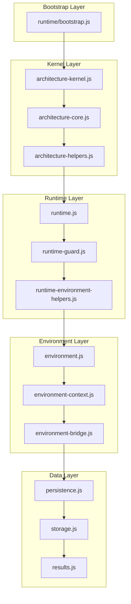

# Cine Power Planner Core Module Overview

This guide captures how the runtime modules inside `src/scripts/modules/`
collaborate to deliver an offline-first experience that never jeopardises user
data. Use it when onboarding, auditing architectural drift or updating
persistence and rehearsal tooling.

> [!NOTE]
> The application is migrating to ES Modules via Vite. While the conceptual layers remain valid,
> newer modules in `src/scripts/modules/` and `src/scripts/v2/` use ESM syntax.
> See [Vite Migration Guide](../vite-migration.md) for details.

## Layered module map

| Layer | Modules | Purpose |
| --- | --- | --- |
| Runtime Bootstrap | `runtime/bootstrap.js` | Provides shared scope detection, boot queue management, and constant exposure utilities across all bundles. |
| Kernel | `architecture-kernel.js`, `architecture-core.js`, `architecture-helpers.js` | Bootstraps the dependency container, normalises environment detection and exposes the guarded module registry. |
| Runtime services | `runtime.js`, `runtime-guard.js`, `runtime-environment-helpers.js` | Coordinates save/autosave/backup/restore flows, validates schema expectations and prevents destructive mutations before they reach storage. |
| Environment bridge | `environment.js`, `environment-context.js`, `environment-bridge.js` | Resolves browser, service-worker and legacy contexts so the same logic works offline from a file:// load, a localhost server or an installed PWA. |
| Data safety | `persistence.js`, `storage.js`, `results.js` | Handles structured cloning, StorageRepository persistence (localStorage boot → IndexedDB primary), redundancy mirroring, and deterministic runtime calculations. |
| User interface | `ui.js`, `system.js`, `settings-and-appearance.js`, `gear-list.js` | Presents the planner shell, binds localised copy and ensures icons/fonts only reference bundled assets. |
| Feature bundles | `features/*`, `help.js`, `localization.js`, `offline.js`, `logging.js` | Encapsulate specialised behaviour such as automatic gear rules, offline cache rehearsals, help centre topics and structured logging. |
| V2 Views | `v2/bootstrap.js`, `v2/view-manager.js`, `v2/sidebar.js`, `v2/views/*` | Modern ES Module UI layer with hash-based routing and dashboard interface. |

### Module loading order

1. **Runtime bootstrap** loads first, initializing `CORE_BOOT_QUEUE` and scope
   detection utilities that other modules depend on.
2. **Kernel initialisation** builds the registry and records a diagnostic snapshot
   of the environment.
3. **Environment bridge** resolves access to `window`, `globalThis`, workers and
   test harnesses so data safety checks never throw when offline.
4. **Runtime guard** injects persistence helpers, structured cloning utilities
   and diffing services before any user data is read.
5. **Feature bundles** register with the module registry and receive a scoped
   API that includes `cinePersistence`, the autosave scheduler, localisation
   helpers and the share/import bus.
6. **Boot queue processing** runs `processCoreBootQueue()` to execute deferred
   initialization tasks that were queued during module loading.
7. **UI shell** hydrates once the runtime exposes a ready state, preventing
   partially initialised forms from touching storage.
8. **V2 bootstrap** initializes the modern view layer, sidebar, and view manager
   for hash-based routing.

## Key module files

| Module | Size | Purpose |
| --- | --- | --- |
| `results.js` | ~150 KB | Power calculation engine, runtime estimates |
| `offline.js` | ~120 KB | Service worker, cache verification, bundle exports |
| `logging.js` | ~108 KB | Structured logging with offline history buffers |
| `settings-and-appearance.js` | ~73 KB | Theme, fonts, accessibility preferences |
| `runtime.js` | ~70 KB | Error boundaries, crash protection, guard logic |
| `persistence.js` | ~35 KB | Save/autosave/backup with redundancy mirrors |
| `ui.js` | ~37 KB | Modal management, DOM utilities |

## Data safety integration points

- **Runtime bootstrap helpers:** The `runtime/bootstrap.js` module provides
  `exposeCoreRuntimeConstant()` for safe global attachment and
  `enqueueCoreBootTask()` / `processCoreBootQueue()` for deferred initialization.
  This ensures critical data safety code runs in the correct order.
- **Redundant persistence:** Every save, autosave and backup call flows through
  `modules/persistence.js`, which clones payloads, writes timestamped mirrors
  and records entries in the verification ledger. StorageRepository boots from
  `localStorage`, migrates to IndexedDB for primary persistence, and uses OPFS
  DataVault snapshots where supported—feature modules never call
  `localStorage` directly.
- **Schema inventory:** `modules/results.js` and `modules/helpers/schema/*.js`
  resolve the `docs/dev/schema-inventory.md` definitions at runtime so imports from
  older builds are coerced into safe shapes or rejected with actionable logs.
- **Share/import bridge:** The `modules/offline.js` surface coordinates planner
  bundle exports, checksum capture and restore rehearsals. It logs outcomes to
  the timeline so documentation packets can attach evidence without re-running
  the app.

## Offline-first considerations

- **Self-contained assets:** UI modules read icons from `src/icons/`, Uicons
  from `src/vendor/` and fonts from `src/fonts/`. No module is permitted to
  fetch remote assets.
- **Service worker handshake:** `modules/offline.js` registers `service-worker.js`
  only when the app is served over `http://localhost`. Offline rehearsals remain
  identical whether the service worker is active or the app is opened from
  `index.html` directly.
- **Boot queue for deferred init:** The `CORE_BOOT_QUEUE` pattern allows modules
  to register initialization tasks that run after all scripts load, ensuring
  dependencies are available and avoiding race conditions.
- **Diagnostics:** `modules/logging.js` streams events to both the console and
  an in-memory log consumed by the Verification Log Template so releases can be
  audited offline. `modules/logging-resolver.js` exposes a safe helper that
  surfaces the structured logger (or a console-backed fallback) to every
  runtime, making log exports and autosave investigations reliable even when
  workers, Node tools or browser previews load the planner in isolation.

## Module dependency diagram

## Maintenance workflow

1. Update this document whenever module responsibilities change or new bundles
   are introduced.
2. Cross-reference the [Documentation Coverage Matrix](../documentation-coverage-matrix.md)
   and [Documentation Maintenance Guide](../documentation-maintenance.md) to
   keep translations, help and printable manuals in sync.
3. Capture rehearsal evidence (screenshots, exported logs, backup archives)
   before committing architectural changes so user data protection remains
   provable even without network access.
4. When adding new modules, use `enqueueCoreBootTask()` for deferred initialization
   to ensure proper loading order.
