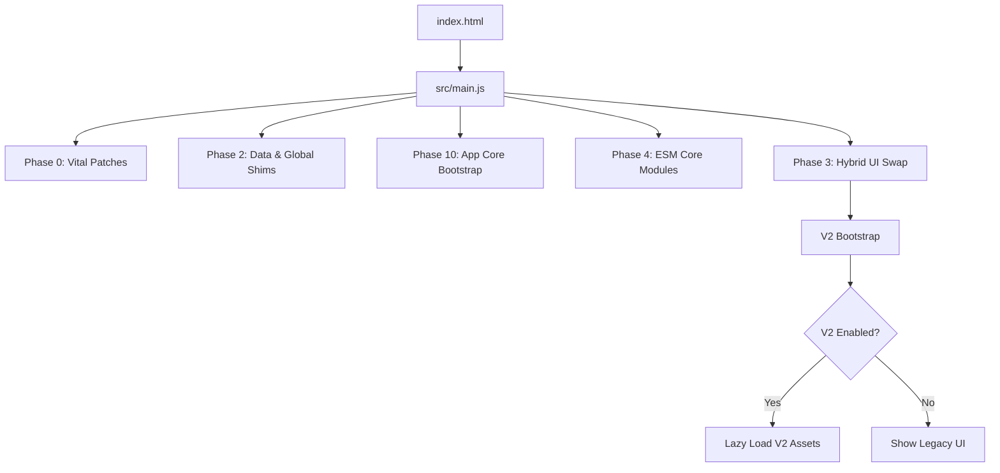

# Application Lifecycle & Boot Sequence

This document describes exactly how the application boots, identifying the sequence of phases, key files, and the "hybrid swap" mechanism that powers the V2 UI.

## 1. Boot Sequence Overview

The application follows a phased initialization strategy defined in `src/main.js`. This ensures critical layers (Polyfills, Data, Core) load before UI initialization.

## 2. Detailed Phases

### Phase 0: Vital Global Patches
*   **File**: `src/scripts/shims/vite-global-patches.js`
*   **Purpose**: Polyfills `global` and ensures environment stability for legacy code.

### Phase 2: Data & Import Shims
*   **Files**: `src/data/devices/index.js`, `src/scripts/translations.js`
*   **Purpose**:
    *   Loads the static Device Catalog.
    *   Exposes `window.devices` for legacy code.
    *   Initializes the Translation Engine.

### Phase 10: App Core Bootstrap
*   **Files**: `src/scripts/core/app-core-bootstrap.js`
*   **Purpose**: Initializes the core event bus and the legacy-compatible runtime environment.

### Phase 4: Core ESM Modules
*   **Files**: `src/scripts/modules/*.js`
*   **Purpose**: Loads modern, isolated modules (Persistence, Offline detection, Logging) that do not depend on global state.

### Phase 3: Hybrid UI Swap (The "Magic")
*   **Entry**: `src/scripts/v2/bootstrap.js`
*   **Mechanism**:
    1.  Checks `localStorage` for `cine_use_v2_ui`.
    2.  **If V2 is Enabled**:
        *   Injects a "Loading V2..." spinner.
        *   Dynamically imports V2 CSS and JS chunk (`loadV2Assets()`).
        *   Applies `body.v2-mode`.
        *   Hides legacy DOM elements (`#topBar`, `#sideMenu`).
        *   Initializes `ViewManager`.
    3.  **If V2 is Disabled**:
        *   Applies standard legacy styles.
        *   Shows legacy DOM elements.

## 3. Key Files

| File | Role | Notes |
| :--- | :--- | :--- |
| `src/main.js` | The Orchestrator | Single entry point. Controls import order. |
| `src/scripts/v2/bootstrap.js` | The Gatekeeper | Manages the V1/V2 toggle and lazy-loading. |
| `src/scripts/v2/view-manager.js` | The Router | Handles hash-based routing in V2 mode. |
| `src/scripts/v2/legacy-shim.js` | The Bridge | Proxies V2 events to legacy logic (e.g., autosave). |

## 4. Debugging Boot Issues

### "V2 Loader Stuck"
*   **Cause**: Dynamic import failure (network error or syntax error in a chunk).
*   **Fix**: Check console for `Failed to load V2 assets`. Run `npm run build` to verify chunk generation.

### "Styles Missing / FOUC"
*   **Cause**: `loadV2Assets` failed to inject CSS before removing the hide mask.
*   **Fix**: Ensure `import('../../styles/v2/index.css')` is awaited in `bootstrap.js`.

### "Legacy Code Cant Find `devices`"
*   **Cause**: Phase 2 didn't complete or globals weren't attached.
*   **Fix**: Verify `window.devices` assignment in `main.js`.
