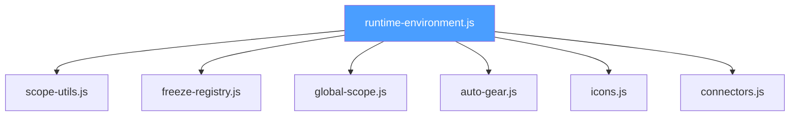

# Runtime Environment Architecture

> **Module**: `src/scripts/modules/runtime-environment.js`
> **Extracted**: Step 24 of the ESM Migration (January 2026)

This document describes the unified runtime environment module that aggregates scope detection, freeze registries, global value management, and auxiliary helpers into a single API.

---

## Overview

The `runtime-environment.js` module consolidates previously scattered environment utilities into a cohesive ESM module. It provides:

- **Scope detection** for cross-environment compatibility (browser, worker, Node)
- **Freeze registry** for tracking immutable objects
- **Global value management** for safe global access
- **Domain-specific helpers** for Auto-Gear, Icons, and Connectors



---

## Module Hierarchy

```
src/scripts/modules/
├── runtime-environment.js        # Aggregate API entry point
└── helpers/
    ├── scope-utils.js            # Global scope detection
    ├── freeze-registry.js        # Frozen object tracking
    ├── global-scope.js           # Global value read/write
    ├── auto-gear.js              # Auto Gear globals fallback
    ├── icons.js                  # Icon font/SVG utilities
    └── connectors.js             # Connector summary generation
```

---

## Namespace API Reference

### `Helpers` — Scope Detection

| Function | Purpose |
|----------|---------|
| `detectGlobalScope()` | Returns the best available global (`globalThis`, `window`, `self`, `global`) |
| `collectCandidateScopes(primary, extras, detect)` | Collects de-duplicated candidate scopes |
| `tryRequire(modulePath)` | Non-throwing CommonJS require |
| `resolveFromScopes(propertyName, options)` | Find scope owning a property |
| `getCachedGlobalValue(key, factory)` | Read/initialize cached global value |

### `Freeze` — Immutable Object Registry

| Function | Purpose |
|----------|---------|
| `createRegistry()` | Create new freeze registry (WeakSet or Array fallback) |
| `has(registry, value)` | Check if value is registered |
| `add(registry, value)` | Add value to registry |
| `getShared()` | Get singleton shared registry |
| `sharedHas(value)` | Check shared registry |
| `sharedAdd(value)` | Add to shared registry |

### `Global` — Safe Global Access

| Function | Purpose |
|----------|---------|
| `read(name)` | Safely read global value |
| `write(name, value)` | Safely write global value |
| `ensure(name, fallback)` | Ensure global exists with fallback |
| `normalise(name, validator, fallback)` | Validate and repair global |

### `AutoGear` — Auto-Gear Globals

| Function | Purpose |
|----------|---------|
| `FALLBACKS` | Default values for Auto-Gear globals |
| `ensure(name, fallback)` | Ensure Auto-Gear global exists |
| `repair()` | Repair all Auto-Gear globals |
| `isReferenceError(error)` | Check if error is Auto-Gear related |

### `Icons` — Icon Utilities

| Function | Purpose |
|----------|---------|
| `createFontKeys()` | Create fallback icon font key map |
| `formatCoordinate(value)` | Format SVG coordinate |
| `positionMarkup(svg, x, y)` | Position SVG markup |
| `resolveGlyph(name)` | Resolve icon glyph by name |
| `applyGlyph(element, glyph)` | Apply glyph to DOM element |

### `Connectors` — Device Connectors

| Function | Purpose |
|----------|---------|
| `createFallbackSummary()` | Create fallback summary generator |
| `generateSummary(device)` | Generate connector summary for device |

---

## Usage Examples

### Basic Scope Detection

```javascript
import { Helpers } from './runtime-environment.js';

const globalScope = Helpers.detectGlobalScope();
const scopes = Helpers.collectCandidateScopes(window, [self]);
```

### Freeze Registry

```javascript
import { Freeze } from './runtime-environment.js';

const myObject = Object.freeze({ id: 1 });
Freeze.sharedAdd(myObject);

if (Freeze.sharedHas(myObject)) {
    console.log('Object is tracked');
}
```

### Safe Global Access

```javascript
import { Global } from './runtime-environment.js';

// Read existing global or return undefined
const devices = Global.read('devices');

// Ensure global exists with fallback
Global.ensure('autoGearRules', () => []);
```

### Local Runtime State Fallback

```javascript
import { createLocalRuntimeStateFallback } from './runtime-environment.js';

const state = createLocalRuntimeStateFallback([window, self]);
state.ensureValue('myGlobal', () => ({}));
```

---

## Migration Notes

### From `app-core-environment.js`

The legacy `app-core-environment.js` now imports from `runtime-environment.js` and exposes globals for backward compatibility:

```javascript
// Legacy shim (app-core-environment.js)
import { Helpers, Freeze, Global } from '../modules/runtime-environment.js';

// Expose as globals for legacy code
window.cineScopeUtils = Helpers;
window.CORE_FREEZE_REGISTRY = Freeze.getShared();
```

### Global Symbol Migration

| Legacy Global | New Import |
|--------------|------------|
| `cineScopeUtils` | `Helpers` namespace |
| `CORE_FREEZE_REGISTRY` | `Freeze.getShared()` |
| `CORE_SHARED.readGlobalScopeValue` | `Global.read()` |
| `CORE_RUNTIME_FALLBACKS` | `createLocalRuntimeStateFallback()` |

---

## Related Documentation

- [**System Architecture Overview**](system-overview.md) (New)
- [Module Registry](module-registry.md) — Module registration system
- [Storage Layer](storage-layer.md) — Data persistence architecture
- [Legacy Integration](legacy-integration.md) — ESM/IIFE bridging
- [Runtime Refactor Status](../reports/runtime-refactor-status-2025.md) — Migration progress
