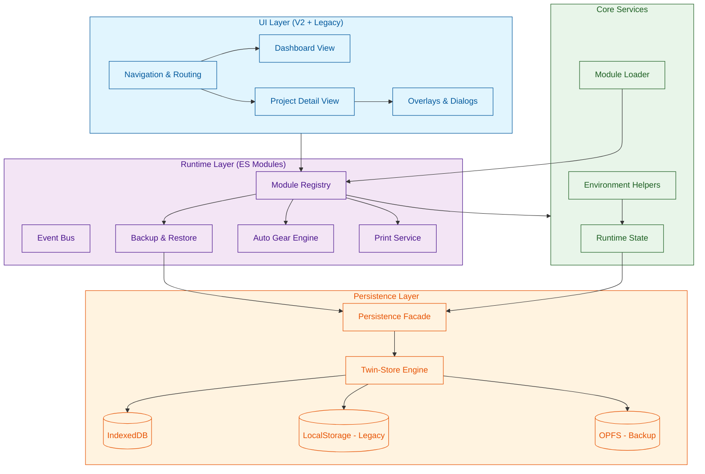

# System Architecture Overview

This document provides a high-level visual map of the Cine Power Planner architecture, illustrating how the UI, Runtime, and Storage layers interact.

## High-Level Component Diagram

## Layer Responsibilities

### 1. UI Layer
Handles user interaction, routing (`v2-views.md`), and presentation. It communicates with the Runtime Layer via the Module Registry and Event Bus.

### 2. Runtime Layer
Orchestrates business logic through isolated feature modules. The **Module Registry** (`module-registry.md`) ensures safe dependency injection and prevents cyclic dependencies.

### 3. Service Layer
Provides foundational utilities like scope detection (`runtime-environment.md`), module loading, and global state management.

### 4. Persistence Layer
Manages data safety using the **Twin-Store Pattern** (`storage-layer.md`). It writes primarily to IndexedDB but mirrors critical data to OPFS (where supported) and falls back to LocalStorage for legacy compatibility.

## Data Flow

1. **User Action**: User updates a camera rigging.
2. **Event**: UI triggers a change event.
3. **Runtime**: `AutoGear` engine evaluates rules based on the new state.
4. **Persistence**: `Persistence Facade` captures the new state.
5. **Storage**: Data is written to IndexedDB and queued for OPFS background backup.
6. **Feedback**: `Runtime State` updates the power summary, which propagates back to the UI.

## Related Documentation

- [Runtime Environment](runtime-environment.md)
- [Module Registry](module-registry.md)
- [Storage Layer](storage-layer.md)
- [V2 Views](../v2-views.md)
