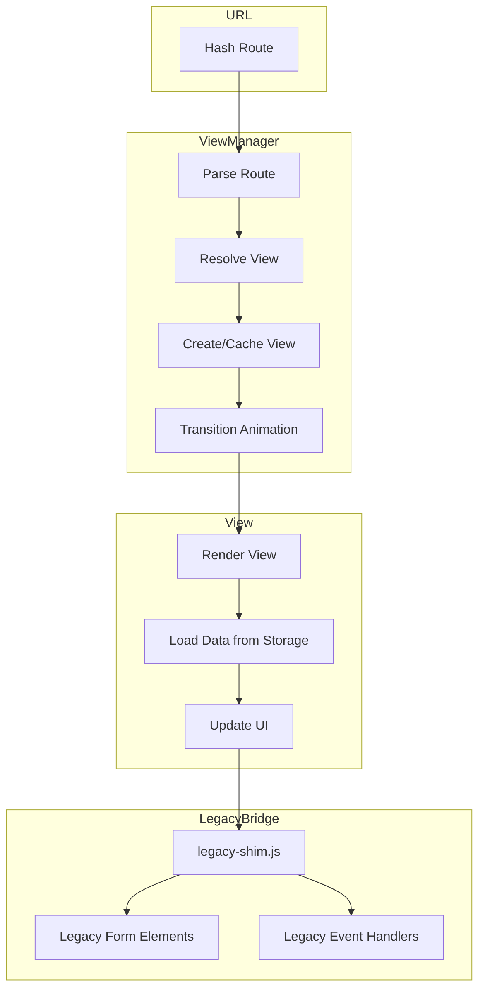

# V2 View Architecture

This document describes the architecture of the V2 user interface system in Cine Power Planner. The V2 UI provides a modern, responsive interface built on ES Modules with hash-based routing.

## Overview

The V2 UI is a complete redesign of the application interface featuring:
- **Dashboard-centric navigation**: Project tiles with status tracking
- **Hash-based routing**: Direct linking to views via URL fragments
- **Sidebar navigation**: Persistent, collapsible navigation with theme controls
- **Mobile-first design**: Responsive layout with touch-optimized controls

> [!NOTE]
> The V2 UI coexists with legacy V1 components through the `legacy-shim.js` bridge.
> Many views re-parent legacy DOM elements rather than reimplementing functionality.

## Core Components

### View Manager (`view-manager.js`)

The central routing component that handles navigation between views.

**Key Responsibilities:**
- Parse hash routes (e.g., `#/projects`, `#/project/my-project`)
- Maintain view state and history
- Coordinate view transitions
- Handle deep linking

**Hash Route Format:**
```
#/view-name                    → Dashboard or list views
#/view-name/resource-id        → Detail views with specific resource
#/view-name/resource-id?tab=X  → Detail views with tab selection
```

**Available Routes:**
| Route | View | Description |
| --- | --- | --- |
| `#/` or `#/projects` | Dashboard | Main project grid |
| `#/project/:name` | Project Detail | Project editing interface |
| `#/device-library` | Device Library | Equipment database browser |
| `#/contacts` | Contacts | Crew roster management |
| `#/owned-gear` | Owned Gear | Personal equipment tracking |
| `#/rules` | Rules | Automatic gear rules editor |
| `#/settings` | Settings | Application preferences |
| `#/help` | Help | Documentation center |
| `#/backups` | Backups | Backup management |

### Bootstrap (`bootstrap.js`)

Initializes the V2 UI and establishes the "Hybrid Swap" pattern.

**Initialization Flow:**
1. Wait for DOM ready
2. Create V2 container elements
3. Initialize sidebar
4. Initialize view manager
5. Register route handlers
6. Parse initial hash route
7. Render initial view

**Hybrid Swap Pattern:**
The V2 UI doesn't replace the legacy UI entirely. Instead:
- V2 components render in dedicated containers
- Legacy elements are re-parented when needed
- Both systems share the same data layer

### Sidebar (`sidebar.js`)

Manages the persistent navigation sidebar.

**Features:**
- Navigation links to all major views
- Search input (proxies to legacy global search)
- Theme toggles (dark mode, pink mode)
- Language selector
- Mobile hamburger toggle
- Collapsed/expanded states with persistence

**Keyboard Shortcuts:**
| Key | Action |
| --- | --- |
| `/` | Focus search |
| `Esc` | Close mobile sidebar |
| `D` | Toggle dark mode |
| `P` | Toggle pink mode |

## View Components

### Project Dashboard (`project-dashboard.js`)

The main landing view displaying all projects as tiles.

**Features:**
- Color-coded project tiles by status
- Grid layout with responsive columns
- Search and filter capabilities
- Context menu (right-click) actions
- Create new project tile

**Project Tile Display:**
- Project name (truncated if long)
- Status badge with color coding
- Created/Updated dates
- Quick action icons

**Context Menu Actions:**
- Open / Edit
- Duplicate
- Archive
- Export as JSON
- Print Overview
- Delete

### Project Detail (`project-detail.js`)

The full project editing interface with tabbed navigation.

**Tabs:**
1. **Camera Package**: Equipment selection, camera/accessory configuration
2. **Power Summary**: Power draw calculations, battery planning
3. **Requirements**: Production details, crew info, scenarios
4. **Gear List**: Generated equipment lists for export

**Legacy Integration:**
The detail view re-parents legacy form elements into V2 tab containers.
This ensures backward compatibility while providing the new navigation structure.

**Status Workflow:**
Projects progress through statuses:
1. Draft → Planning → Waiting for Approval → Approved → Shooting → Completed → Archived

### Specialized Views (`views/` directory)

#### `contacts-view.js`
- Display crew roster in a list/grid
- Individual contact cards with photos
- Add/Edit contact modal
- Import from vCard (`.vcf` files)
- Save contact to roster for reuse

#### `device-library-view.js`
- Browse the equipment database
- Search and filter by category
- View device specifications
- Add to current project

#### `help-view.js`
- Table of contents navigation
- Search help topics
- Markdown content rendering
- Quick start checklist integration

#### `owned-gear-view.js`
- Track personal equipment
- Quantity and sourcing notes
- Integration with auto gear rules

#### `rules-view.mjs`
- Automatic gear rule builder
- Coverage dashboard
- Conflict detection
- Rule import/export

#### `settings-view.js`
- Theme and appearance controls
- Font size and family
- Backup and restore
- Factory reset (with safety backup)

## Data Flow



## Styling Architecture

V2 views use a combination of:
- **CSS Custom Properties**: Theme tokens defined in `style.css`
- **BEM-like Classes**: Scoped component styling (e.g., `.v2-sidebar`, `.v2-project-tile`)
- **Responsive Breakpoints**: Mobile-first with `@media` queries

**CSS Custom Properties Used:**
```css
--v2-sidebar-width
--v2-tile-gap
--v2-header-height
--v2-accent-color (inherits from global)
```

## Integration with Legacy Code

The `legacy-shim.js` provides the bridge between V2 and V1:

### Element Re-parenting
```javascript
// V2 moves legacy elements into new containers
legacyShim.reparentElement('#cameraGroupsContainer', v2TabPanel);
```

### Event Proxying
```javascript
// V2 listens for legacy events
legacyShim.onProjectSaved(() => dashboard.refreshTile(projectId));
```

### Function Delegation
```javascript
// V2 calls legacy functions when needed
legacyShim.generateGearList(projectId);
```

## State Management

V2 views primarily rely on:
1. **URL State**: Hash routes for navigation state
2. **Storage.js**: Shared persistence layer with legacy
3. **Component State**: Local state within view instances
4. **Session State**: `app-session.js` for active project tracking

Views don't maintain their own data stores—they read/write through the same
storage layer as legacy code to ensure data consistency.

## Adding New Views

To add a new view to the V2 system:

1. **Create the view file** in `src/scripts/v2/views/`:
```javascript
// my-view.js
export function createMyView(container) {
  // Render logic
}

export function destroyMyView() {
  // Cleanup logic
}
```

2. **Register the route** in `view-manager.js`:
```javascript
routes.set('my-view', {
  create: createMyView,
  destroy: destroyMyView,
  title: 'My View'
});
```

3. **Add sidebar navigation** in `sidebar.js`:
```javascript
{ id: 'my-view', icon: 'icon-name', label: 'My View' }
```

4. **Update translations** for the new view labels.

## Testing Considerations

V2 views are primarily tested via:
- **Manual browser testing**: UI interactions, routing
- **Console verification scripts**: `verify_*.js` scripts
- **Jest DOM tests**: For isolated utility functions

Due to the DOM-heavy nature and legacy integration, automated e2e testing
coverage is limited. See [TESTING.md](../../TESTING.md) for details.
