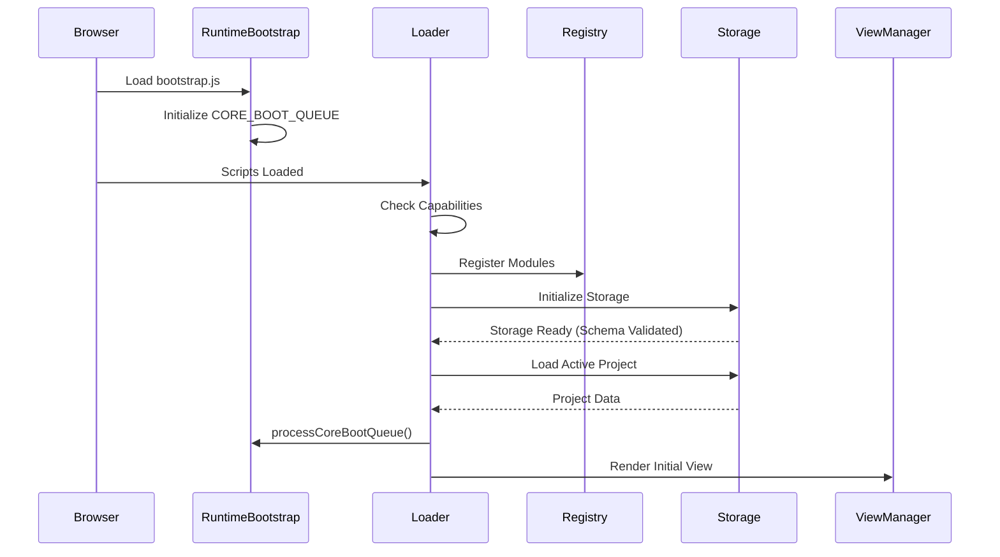
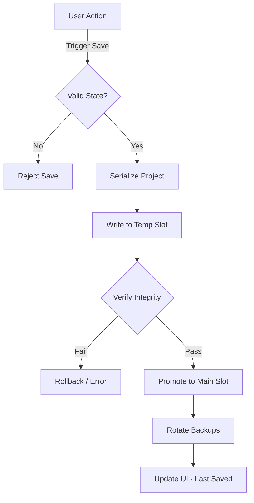
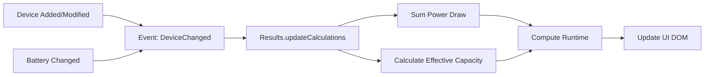
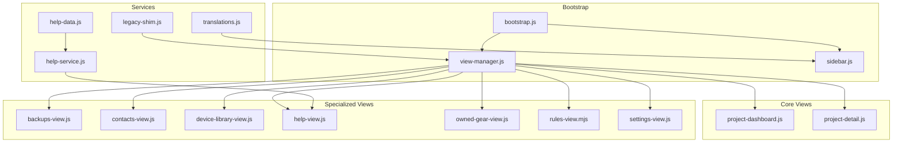
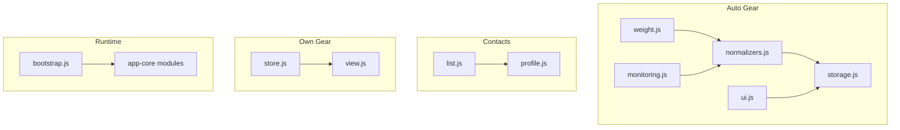

# Codebase Overview

This document provides a high-level map of the Cine Power Planner codebase. It is intended to help developers navigate the project, understand key architectural decisions, and grasp the flow of data through the application.

> [!NOTE]
> The codebase uses ES Modules via Vite. Core modules in `src/scripts/modules/` are ESM with global fallbacks for backward compatibility.

## Directory Structure

The `src/scripts` directory is the heart of the application logic.

### Root Entry Points
- **`src/main.js`**: Vite entry point (ESM). Imports core modules and bootstraps the V2 UI.
- **`vite.config.js`**: Build configuration with code splitting and service worker generation.

### `src/scripts/core`
Contains the large "application layer" files that orchestrate the UI and business logic.
- **`app-session.js`**: Manages the current user session, active project state, and cross-tab synchronization.
- **`app-events.js`**: UI event binding and legacy event proxies.
- **`app-core-new-1.js` / `app-core-new-2.js`**: Monolithic legacy files containing much of the original application logic.

### `src/scripts`
Contains the top-level application entry points and core utilities.
- **`loader.js`**: Legacy entry point. Bootstraps the environment, loads modules, and initializes the UI.
- **`storage.js`**: Manages all local persistence, including the "safe save" mechanism, IndexedDB-first writes, OPFS backups, and legacy localStorage migration fallbacks.
- **`globals-bootstrap.js`**: The "Resilient Scope" pattern—ensures global state is defined before other modules run.

### `src/scripts/runtime`
Contains the shared runtime bootstrap helpers used across all bundles.
- **`bootstrap.js`**: Provides core runtime initialization utilities shared between Part 1, Part 2, legacy bundles, and Jest tests. Key exports include:
  - `getGlobalScopeCandidates()` / `getPrimaryGlobalScope()`: Safe scope detection across browser, worker, and Node contexts.
  - `exposeCoreRuntimeConstant()`: Safely attaches values to the global scope with fallback strategies.
  - `CORE_BOOT_QUEUE` / `enqueueCoreBootTask()` / `processCoreBootQueue()`: Deferred initialization queue for tasks that must run after all modules load.
  - Grid snap state management utilities for diagram preferences.

### `src/scripts/modules`
Implements the core business logic of the application. These modules are responsible for data management, calculations, and persistence.
- **`results.js`**: The calculation engine. It computes runtimes, power draw, and generates the data for the UI.
- **`registry.js`**: A dependency injection container that manages module lifecycle.
- **`logging.js`**: Centralized logging facility with offline history buffers.
- **`system.js`**: Browser capability detection and the "Kernel" pattern.
- **`globals.js`**: Global state and constants.

### `src/scripts/auto-gear`
Implements the Automatic Gear Rules feature for scenario-triggered equipment management.
- **`normalizers.js`** / **`normalizers.ts`**: Equipment normalization logic and category mapping for auto-generated gear lists.
- **`storage.js`** / **`storage.ts`**: Persistence layer for automatic gear rules with backup/restore support.
- **`monitoring.js`**: Rule execution monitoring and coverage tracking.
- **`ui.js`** / **`ui.ts`**: UI helper functions for the rules editor.
- **`weight.js`**: Weight calculation and tripod/support equipment matching.

### `src/scripts/contacts`
Manages the crew contact roster feature.
- **`list.js`**: Contact list rendering, filtering, and CRUD operations.
- **`profile.js`**: Individual contact profile management, photo handling, and vCard import/export.

### `src/scripts/own-gear`
Tracks personal equipment inventory.
- **`store.js`**: Persistence layer for owned gear entries with IndexedDB-first storage and legacy localStorage fallback support.
- **`view.js`**: UI rendering for the owned gear list, inline editing, and quantity tracking.

### `src/scripts/shims`
Compatibility shims for legacy code and polyfills.
- Provides fallbacks for older browsers and bridges between ESM and IIFE patterns.

### `src/scripts/v2`
Contains the View layer for the V2 UI (the modern interface).
- **`bootstrap.js`**: Entry point for V2 UI initialization (Hybrid Swap pattern).
- **`project-dashboard.js`**: Renders the main dashboard view with project tiles, filtering, context menus, and project CRUD operations.
- **`project-detail.js`**: Handles the project detail view with tabs (Camera Package, Power Summary, Requirements, Gear List), status dropdown, and legacy element re-parenting.
- **`sidebar.js`**: Manages the sidebar navigation, search proxy to legacy search, theme toggles (dark/pink mode), mobile toggle, and language selector.
- **`view-manager.js`**: Handles view routing, hash-based navigation, and switching between different views.
- **`help-data.js`**: Static V2-specific help content definitions.
- **`help-service.js`**: Merges V2 help data with legacy localized help topics.
- **`legacy-shim.js`**: Bridges V2 components with legacy V1 functionality.
- **`translations.js`**: V2-specific translation key management.

### `src/scripts/v2/views`
Specialized view components for specific application sections:
- **`backups-view.js`**: Backup management and restore interface.
- **`contacts-view.js`**: Crew contact management with vCard import support and profile photo handling.
- **`device-library-view.js`**: Equipment database browser wrapping legacy device manager with search and filtering.
- **`help-view.js`**: In-app help center with table of contents, search, and content display.
- **`owned-gear-view.js`**: Personal equipment inventory tracking with quantity and sourcing notes.
- **`rules-view.mjs`**: Automatic gear rule configuration, coverage dashboard, and conflict detection.
- **`settings-view.js`**: Application settings, preferences, theme controls, and backup/restore controls.

## Key Files & Responsibilities

### `src/scripts/loader.js`
**Role:** Orchestrator
The `loader.js` file is the first script to run. It:
1. Detects browser capabilities.
2. Initializes the `Registry`.
3. Loads core modules (`logging`, `storage`, `results`).
4. Bootstraps the UI.
5. Handles the initial data load from IndexedDB (falling back to localStorage only for legacy migration/compatibility when needed).

### `src/scripts/runtime/bootstrap.js`
**Role:** Runtime Foundation
This module provides shared helpers that were previously duplicated across app-core files:
- **Scope Detection**: Safely identifies the global scope across different JavaScript environments (browser, worker, Node.js).
- **Boot Queue**: Manages deferred initialization tasks that must run after all modules are loaded.
- **Constant Exposure**: Provides defensive helpers for attaching values to the global scope without overwriting existing definitions.
- **Grid Snap State**: Centralizes diagram grid snap preferences with cross-scope synchronization.

### `src/scripts/storage.js`
**Role:** Persistence Layer
This module is critical for data safety. It implements a "Snapshot & Commit" strategy:
- **Write Safety**: Before saving, it serializes the current state to a temporary slot, verifies integrity, and only then promotes it to the main slot.
- **Backup Rotation**: Automatically rotates backups (A/B/C) on every save to prevent data loss from corruption.
- **Storage Targets**: Writes to IndexedDB first, mirrors to OPFS where supported for backups, and keeps legacy localStorage fallback paths available only for migration or constrained environments.

### `src/scripts/modules/results.js`
**Role:** Calculation Engine
This logic computes the power model:
- **Inputs**: Batteries (voltage, capacity), Devices (voltage, draw), Safe Margins.
- **Logic**: Aggregates total draw, calculates effective capacity (accounting for Peukert effect/efficiency), and derives remaining runtime.

### `src/scripts/auto-gear/normalizers.js`
**Role:** Equipment Intelligence
Provides the logic for automatic gear list generation:
- **Category Mapping**: Maps scenarios and requirements to equipment categories.
- **Normalization**: Standardizes equipment names and specifications.
- **Weight Matching**: Pairs tripods and heads based on rig weight calculations.

## Architectural Visualization

### Startup Sequence

### Data Persistence Cycle

### Calculation Engine Loop

### V2 View Architecture

### Feature Module Architecture

