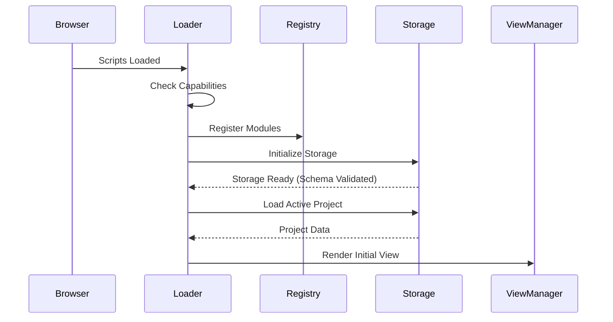
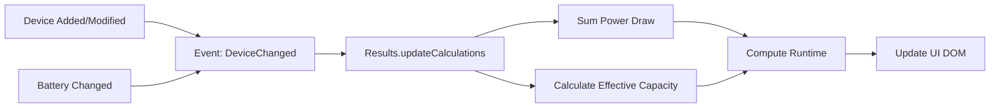

# Codebase Overview

This document provides a high-level map of the Cine Power Planner codebase. It is intended to help developers navigate the project, understand key architectural decisions, and grasp the flow of data through the application.

## Directory Structure

The `src/scripts` directory is the heart of the application logic.

### `src/scripts/core`
Contains the large "application layer" files that orchestrate the UI and business logic.
- **`app-session.js`**: Manages the current user session, active project state, and cross-tab synchronization.
- **`app-events.js`**: UI event binding and legacy event proxies.
- **`app-core-new-1.js` / `app-core-new-2.js`**: Monolithic legacy files containing much of the original application logic.

### `src/scripts`
Contains the top-level application entry points and core utilities.
- **`loader.js`**: The entry point of the application. It bootstraps the environment, loads modules, and initializes the UI.
- **`storage.js`**: Manages all local storage interactions, including the "safe save" mechanism and backup rotation.
- **`globals-bootstrap.js`**: The "Resilient Scope" pattern—ensures global state is defined before other modules run.

### `src/scripts/modules`
Implements the core business logic of the application. These modules are responsible for data management, calculations, and persistence.
- **`results.js`**: The calculation engine. It computes runtimes, power draw, and generates the data for the UI.
- **`registry.js`**: A dependency injection container that manages module lifecycle.
- **`logging.js`**: Centralized logging facility with offline history buffers.
- **`system.js`**: Browser capability detection and the "Kernel" pattern.
- **`globals.js`**: Global state and constants.

### `src/scripts/v2`
Contains the View layer for the V2 UI (the modern interface).
- **`project-dashboard.js`**: Renders the main dashboard view.
- **`sidebar.js`**: Manages the sidebar navigation and state.
- **`view-manager.js`**: Handles switching between different views (Dashboard, Settings, etc.).
- **`bootstrap.js`**: Entry point for V2 UI initialization (Hybrid Swap pattern).

## Key Files & Responsibilities

### `src/scripts/loader.js`
**Role:** Orchestrator
The `loader.js` file is the first script to run. It:
1. Detects browser capabilities.
2. Initializes the `Registry`.
3. Loads core modules (`logging`, `storage`, `results`).
4. Bootstraps the UI.
5. Handles the initial data load from LocalStorage.

### `src/scripts/storage.js`
**Role:** Persistence Layer
This module is critical for data safety. It implements a "Snapshot & Commit" strategy:
- **Write Safety**: Before saving, it serializes the current state to a temporary slot, verifies integrity, and only then promotes it to the main slot.
- **Backup Rotation**: Automatically rotates backups (A/B/C) on every save to prevent data loss from corruption.

### `src/scripts/modules/results.js`
**Role:** Calculation Engine
This logic computes the power model:
- **Inputs**: Batteries (voltage, capacity), Devices (voltage, draw), Safe Margins.
- **Logic**: Aggregates total draw, calculates effective capacity (accounting for Peukert effect/efficiency), and derives remaining runtime.

## Architectural Visualization

### Startup Sequence



### Data Persistence Cycle

```mermaid
flowchart TD
    A[User Action] -->|Trigger Save| B{Valid State?}
    B -- No --> C[Reject Save]
    B -- Yes --> D[Serialize Project]
    D --> E[Write to Temp Slot]
    E --> F{Verify Integrity}
    F -- Fail --> G[Rollback / Error]
    F -- Pass --> H[Promote to Main Slot]
    H --> I[Rotate Backups]
    I --> J[Update UI (Last Saved)]
```

### Calculation Engine Loop


