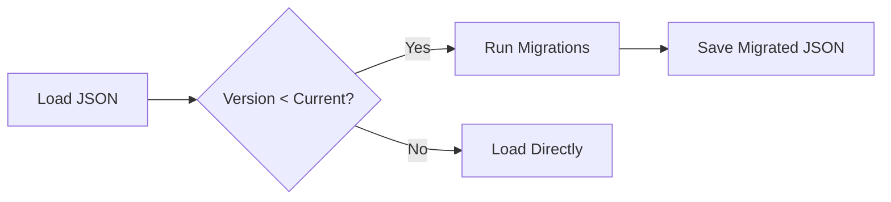

# Schema Evolution & Data Migration

> "Data is forever. Code is transient."

Changing the shape of `Project` data or `Device` catalogs requires careful planning to avoid breaking users' existing saved projects (IndexedDB/Backups).

## 1. The Two Schemas

### A. The Device Schema (`src/data/devices/*.js`)
*   **What**: Static hardware specs (Cameras, Batteries).
*   **Enforcement**: `src/data/schema.json` (Generated).
*   **Validation**: `npm run check-consistency`.

**To Add a Field:**
1.  Update the JS files in `src/data/devices/`.
2.  Run `npm run normalize` (to sort keys).
3.  Run `npm run generate-schema` (to update the contract).
4.  Commit `schema.json`.

### B. The Project Schema (`IDB: cine_project`)
*   **What**: User-created save files.
*   **Versioning**: We use a `schemaVersion` integer in the root object.

## 2. Migration Strategy (StorageMigrationService)

When loading a project, `StorageMigrationService.js` checks its version.



### Writing a Migration
Located in `src/scripts/modules/storage/migrations/`.

1.  **Create a Transform**:
    ```javascript
    export function migrateV1toV2(project) {
      if (!project.newField) {
        project.newField = 'default';
      }
      return project;
    }
    ```

2.  **Register it**:
    Update `StorageMigrationService.js` to include the new step in the chain.

## 3. Breaking Changes checklist

Before renaming or removing a field:

1.  [ ] **Greppable**: Search the *entire* codebase (V2 + Legacy) for key usage.
2.  [ ] **Backwards Compat**: Does the `loadProject` function handle `undefined` for this field?
3.  [ ] **Migration**: Have you written a migration script for existing IDB data?
4.  [ ] **Export/Import**: Verify that importing an *old* backup file still works (it should trigger migration on import).

## 4. Testing Migrations

Use `tests/unit/storage/migration.test.js`.

1.  Create a mock "Old Project" JSON fixture.
2.  Pass it through the migration service.
3.  Assert the output matches the "New Schema".
