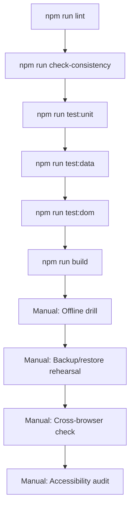

# Testing Plan

This plan defines the coverage required before shipping Cine Power Planner
updates. Prioritise persistence, offline behaviour and documentation accuracy.

## Priority Hierarchy

1. **Critical**: Data persistence, backup/restore, offline operation
2. **High**: Power calculations, device catalog, project management
3. **Medium**: UI functionality, settings, localization
4. **Low**: Cosmetic, non-blocking enhancements

## Automated Checks

### Development & Build

| Command | Purpose | Notes |
| --- | --- | --- |
| `npm run dev` | Start development server with HMR | Primary development workflow |
| `npm run build` | Validate production build in `dist/` | Confirm build success before releases |
| `npm run preview` | Preview production build | Test production bundle locally |

### Testing Commands

| Command | Purpose | Heap Limit | Notes |
| --- | --- | --- | --- |
| `npm test` | Full suite (lint + checks + Jest) | 3 GB | Pre-commit/CI |
| `npm run test:unit` | Module-level logic | 1 GB | Pure function tests |
| `npm run test:data` | Device catalog validation | 1 GB | Schema checks |
| `npm run test:dom` | DOM utility tests | 1.5 GB | jsdom environment |
| `npm run test:script` | Integration tests | 3 GB | Requires `RUN_HEAVY_TESTS=true` |

### Linting & Consistency

| Command | Purpose | Notes |
| --- | --- | --- |
| `npm run lint` | ESLint code style | Storage/persistence warnings are critical |
| `npm run check-consistency` | Device data + SW manifest | Run after asset changes |
| `npm run generate:sw-assets` | Rebuild SW asset manifest | After touching cached assets |

> [!TIP]
> See [tests/README.md](../../tests/README.md) for the 4-tier testing strategy.
> See [TESTING.md](../../TESTING.md) for Jest configuration details.

## Manual Rehearsals

### Pre-Release Checklist

- [ ] Complete the [Operations Checklist](operations-checklist.md)
- [ ] Run the [Offline Cache Verification Drill](offline-cache-verification-drill.md)
- [ ] Execute backup/restore rehearsals on at least two machines
- [ ] Validate translations by switching locales
- [ ] Test keyboard navigation for major workflows
- [ ] Verify screen reader compatibility for critical actions

### Browser Testing Matrix

| Browser | Priority | Notes |
| --- | --- | --- |
| Chrome (latest) | Critical | Primary target |
| Safari (latest) | Critical | iOS/macOS users |
| Firefox (latest) | High | Secondary target |
| Edge (latest) | Medium | Chromium-based |
| Chrome (prev 2) | Medium | Stability check |

### Device Testing

| Device | Priority | Focus Areas |
| --- | --- | --- |
| Desktop (1080p+) | Critical | Full workflow |
| iPad | High | Touch, landscape/portrait |
| iPhone | High | Mobile layout, touch |
| Android Tablet | Medium | Chrome compatibility |

## Regression Focus Areas

### 1. Persistence (Critical)

- [ ] Manual save creates recoverable entry
- [ ] Autosave triggers at configured interval
- [ ] Backup rotation works correctly (A/B/C slots)
- [ ] Project export produces valid JSON
- [ ] Project import handles malformed data gracefully
- [ ] Factory reset creates pre-reset backup

### 2. Offline Readiness (Critical)

- [ ] App functions without network (DevTools offline toggle)
- [ ] App loads from `file://` protocol (index.html)
- [ ] Service worker caches all required assets
- [ ] Force Reload re-registers service worker
- [ ] Offline indicator displays correctly

### 3. Power Calculations (High)

- [ ] Total draw sums correctly
- [ ] Runtime estimates account for efficiency
- [ ] Battery comparison shows accurate deltas
- [ ] Voltage warnings trigger at thresholds

### 4. Documentation (High)

- [ ] Help center topics load correctly
- [ ] Quick start checklist functions
- [ ] UI labels match documentation text
- [ ] Localized docs match UI language

### 5. Accessibility (High)

- [ ] Keyboard navigation works end-to-end
- [ ] Focus indicators are visible
- [ ] Screen reader announces critical changes
- [ ] High contrast mode is readable
- [ ] Font scaling works without overflow

## Test Execution Order

For major releases, execute tests in this order:

## Evidence Collection

### Required Artifacts

- [ ] Test output logs (Jest results)
- [ ] Screenshots of critical workflows
- [ ] Backup archive samples
- [ ] Service worker cache state
- [ ] Console logs during offline operation

### Storage Locations

- Store test outputs with verification packet in `docs/ops/`
- Record command results in `docs/ops/verification-log-template.md`
- Update `docs/dev/reviews/review-findings.md` with regressions
- Track remediation in active review tasks file

## Known Test Limitations

### Automated Browser Testing

Current limitations with automated browser subagents:
- Connection resets during complex multi-step flows
- Page load hangs at "Preparing planner..."
- Service worker interactions unreliable

**Workaround**: Use console verification scripts for UI-heavy tests.
See [TESTING.md](../../TESTING.md) for manual testing workflow.

### Heavy Tests

Script integration tests (`test:script`) require:
- `RUN_HEAVY_TESTS=true` environment variable
- 3 GB heap allocation
- Extended timeout (may take 2-3 minutes)

## Related Documentation

- [TESTING.md](../../TESTING.md) — Test commands and Jest configuration
- [Operations Checklist](operations-checklist.md) — Pre-deployment verification
- [Offline Cache Verification Drill](offline-cache-verification-drill.md) — Cache testing
- [Documentation Verification Packet](documentation-verification-packet.md) — Evidence template
